# Summary of 3_Linear

[<< Go back](../README.md)

## Logistic Regression (Linear)
- **n_jobs**: -1
- **explain_level**: 2

## Validation
 - **validation_type**: split
 - **train_ratio**: 0.75
 - **shuffle**: True
 - **stratify**: True

## Optimized metric
average_precision

## Training time

2.9 seconds

## Metric details
|           |    score |   threshold |
|:----------|---------:|------------:|
| logloss   | 0.377356 |  nan        |
| auc       | 0.870302 |  nan        |
| f1        | 0.714286 |    0.455478 |
| accuracy  | 0.861257 |    0.595762 |
| precision | 0.904762 |    0.864203 |
| recall    | 1        |    0        |
| mcc       | 0.616074 |    0.487712 |

## Metric details with threshold from accuracy metric
|           |    score |   threshold |
|:----------|---------:|------------:|
| logloss   | 0.377356 |  nan        |
| auc       | 0.870302 |  nan        |
| f1        | 0.700565 |    0.595762 |
| accuracy  | 0.861257 |    0.595762 |
| precision | 0.765432 |    0.595762 |
| recall    | 0.645833 |    0.595762 |
| mcc       | 0.614853 |    0.595762 |

## Confusion matrix (at threshold=0.595762)
|              |   Predicted as 0 |   Predicted as 1 |
|:-------------|-----------------:|-----------------:|
| Labeled as 0 |              267 |               19 |
| Labeled as 1 |               34 |               62 |

## Learning curves
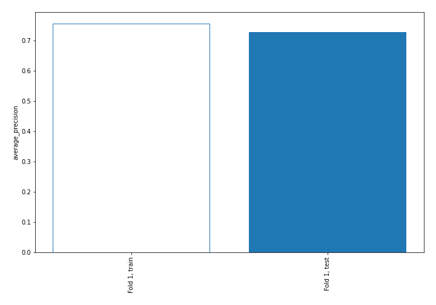

## Coefficients
| feature             |   Learner_1 |
|:--------------------|------------:|
| DGORDERchange       |  0.642766   |
| unrate              |  0.630659   |
| WBAAchange          |  0.599606   |
| BOGMBASEchange      |  0.505488   |
| WBAA                |  0.500824   |
| DEXCHUS             |  0.400799   |
| INDPRO              |  0.340009   |
| 3yocfgrowth         |  0.336917   |
| TCU                 |  0.318083   |
| BOGMBASE            |  0.306901   |
| pfcf                |  0.27695    |
| TOTALSL             |  0.2713     |
| roic                |  0.262982   |
| roe                 |  0.227642   |
| Insiders            |  0.225381   |
| DEXCHUSchange       |  0.20169    |
| capexsales          |  0.186637   |
| netdebtebitda       |  0.178098   |
| pe                  |  0.158083   |
| evebitda            |  0.136234   |
| PSAVERTchange       |  0.133817   |
| HOUSTchange         |  0.109564   |
| 1ybeforepricechange |  0.0938722  |
| assetgrowth         |  0.0855505  |
| Own Change          |  0.0703563  |
| HOUST               |  0.0540597  |
| ptb                 |  0.0379968  |
| pb                  |  0.0379968  |
| inventorygrowth     |  0.0308069  |
| fcfgrowth           |  0.014768   |
| pocf                |  0.00362839 |
| WGS3MOchange        | -0.00140171 |
| debttoequity        | -0.0033581  |
| BUSINV              | -0.0144139  |
| evs                 | -0.0462826  |
| m2supply            | -0.0509764  |
| capexocf            | -0.0547813  |
| ps                  | -0.0580274  |
| 1ychangepe          | -0.0829105  |
| ebitgrowth          | -0.0861804  |
| debttoassets        | -0.0936019  |
| sbcsales            | -0.10481    |
| evocf               | -0.11144    |
| interestcoverage    | -0.111645   |
| fedfundschange      | -0.113012   |
| 3yequitygrowth      | -0.120024   |
| TOTALSLchange       | -0.142911   |
| DEXUSEUchange       | -0.143597   |
| SPCS20RSAchange     | -0.148232   |
| fedfunds            | -0.153369   |
| evfcf               | -0.157432   |
| TCUchange           | -0.194597   |
| UNDCONTSA           | -0.22947    |
| Value Traded        | -0.231117   |
| DEXUSEU             | -0.240122   |
| debtgrowth          | -0.262328   |
| BUSINVchange        | -0.280351   |
| 3ysalesgrowth       | -0.304457   |
| BUSLOANSchange      | -0.311934   |
| SPCS20RSA           | -0.346989   |
| INDPROchange        | -0.350389   |
| DGORDER             | -0.369703   |
| currentratio        | -0.394691   |
| WGS10YRchange       | -0.434417   |
| BUSLOANS            | -0.478338   |
| WGS3MO              | -0.577994   |
| m2supplychange      | -0.593936   |
| salesgrowth         | -0.60771    |
| Price               | -0.631593   |
| PSAVERT             | -0.651361   |
| UNDCONTSAchange     | -0.759732   |
| WGS10YR             | -1.11869    |
| intercept           | -1.29134    |

## Permutation-based Importance
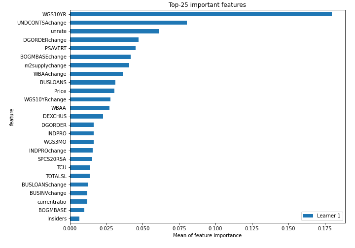
## Confusion Matrix

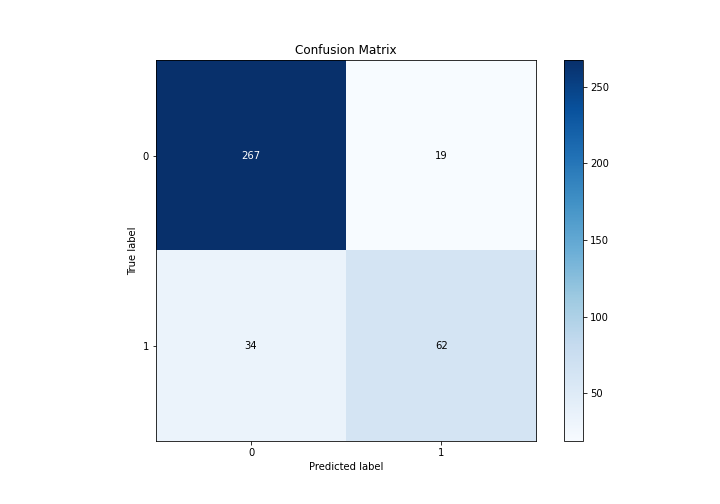

## Normalized Confusion Matrix

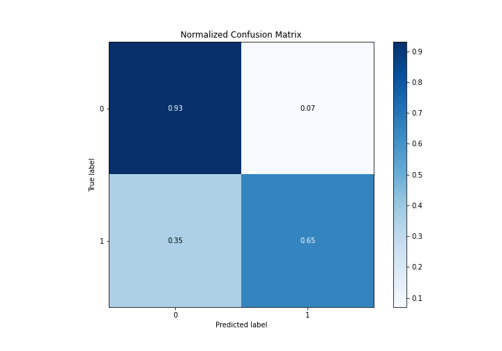

## ROC Curve

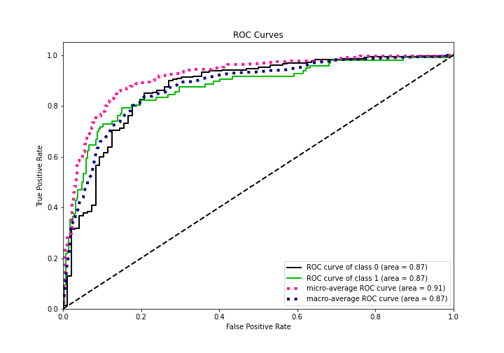

## Kolmogorov-Smirnov Statistic

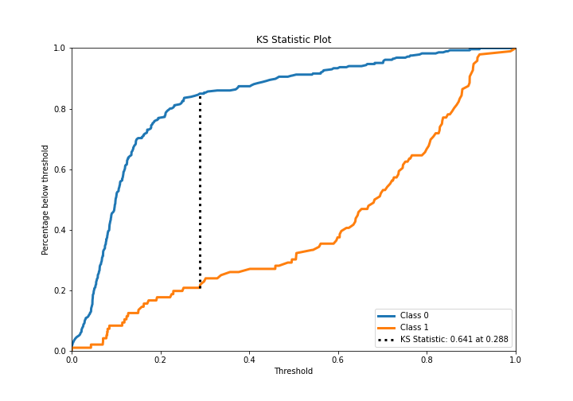

## Precision-Recall Curve

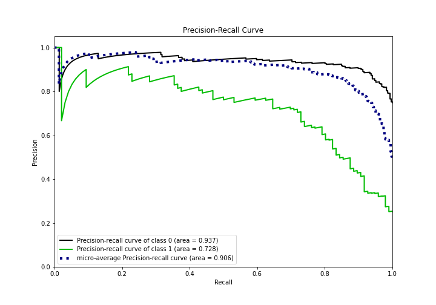

## Calibration Curve

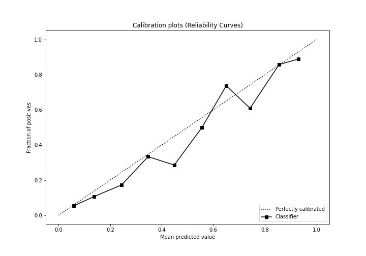

## Cumulative Gains Curve

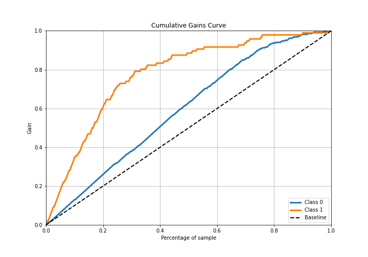

## Lift Curve

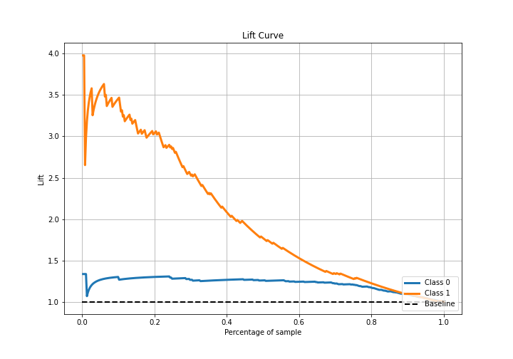

## SHAP Importance
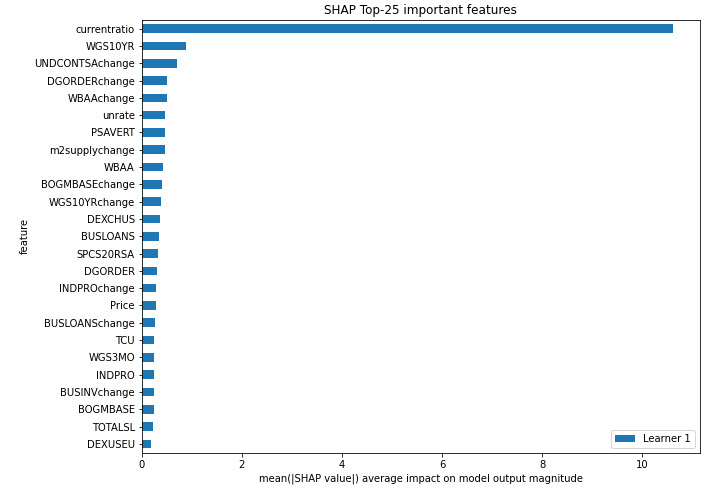

## SHAP Dependence plots

### Dependence (Fold 1)
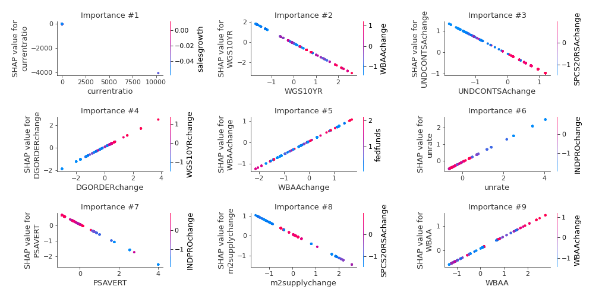

## SHAP Decision plots

### Top-10 Worst decisions for class 0 (Fold 1)

### Top-10 Best decisions for class 0 (Fold 1)
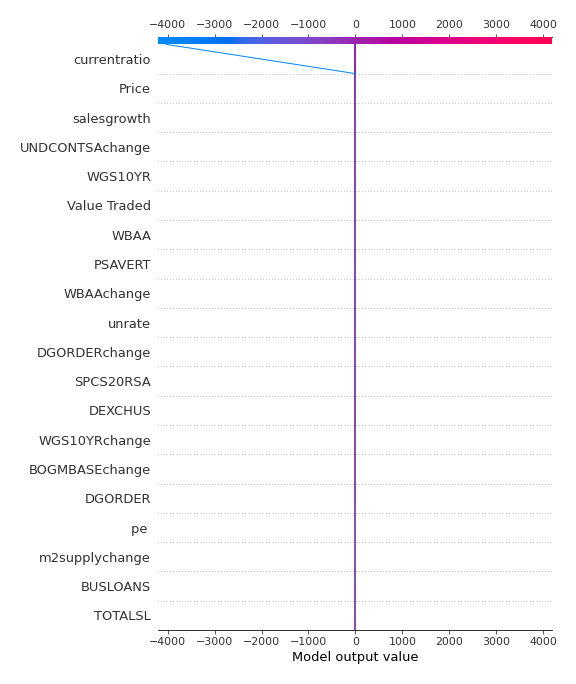
### Top-10 Worst decisions for class 1 (Fold 1)
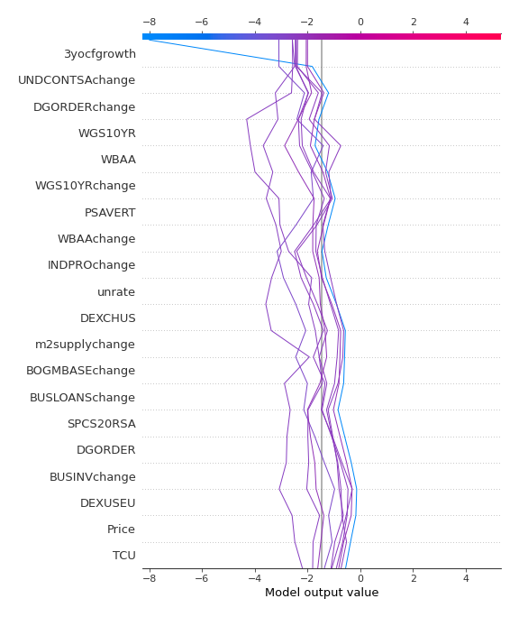
### Top-10 Best decisions for class 1 (Fold 1)
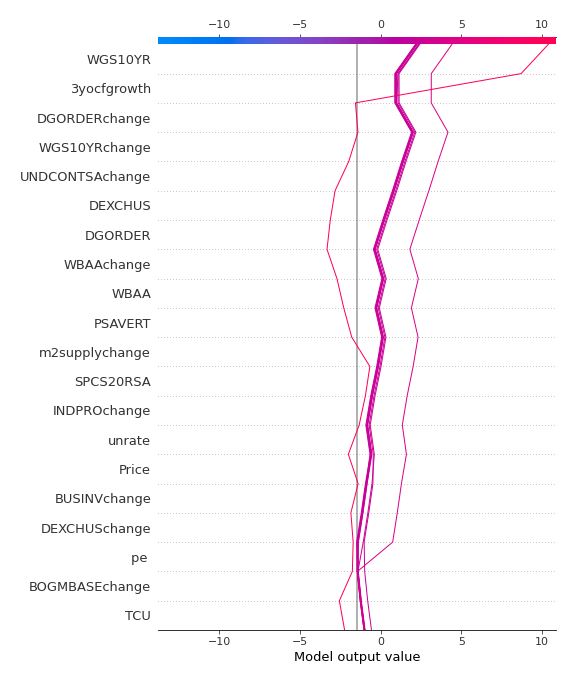

[<< Go back](../README.md)
