# Summary of 3_Linear_GoldenFeatures

[<< Go back](../README.md)

## Logistic Regression (Linear)
- **n_jobs**: -1
- **explain_level**: 2

## Validation
 - **validation_type**: split
 - **train_ratio**: 0.75
 - **shuffle**: True
 - **stratify**: True

## Optimized metric
average_precision

## Training time

2.9 seconds

## Metric details
|           |    score |   threshold |
|:----------|---------:|------------:|
| logloss   | 0.376071 |  nan        |
| auc       | 0.872487 |  nan        |
| f1        | 0.707692 |    0.462593 |
| accuracy  | 0.863874 |    0.585473 |
| precision | 0.904762 |    0.86688  |
| recall    | 1        |    0        |
| mcc       | 0.619782 |    0.585473 |

## Metric details with threshold from accuracy metric
|           |    score |   threshold |
|:----------|---------:|------------:|
| logloss   | 0.376071 |  nan        |
| auc       | 0.872487 |  nan        |
| f1        | 0.701149 |    0.585473 |
| accuracy  | 0.863874 |    0.585473 |
| precision | 0.782051 |    0.585473 |
| recall    | 0.635417 |    0.585473 |
| mcc       | 0.619782 |    0.585473 |

## Confusion matrix (at threshold=0.585473)
|              |   Predicted as 0 |   Predicted as 1 |
|:-------------|-----------------:|-----------------:|
| Labeled as 0 |              269 |               17 |
| Labeled as 1 |               35 |               61 |

## Learning curves
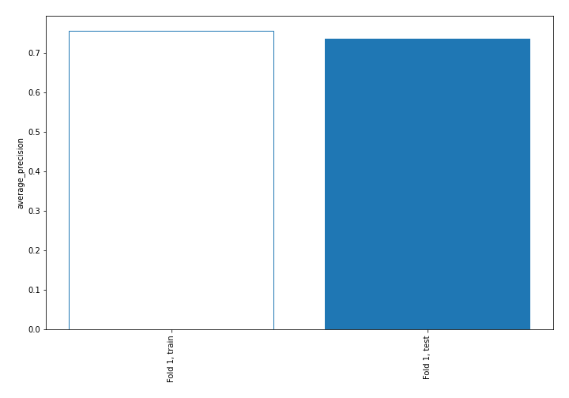

## Coefficients
| feature                           |    Learner_1 |
|:----------------------------------|-------------:|
| WBAAchange                        |  0.707034    |
| DGORDERchange                     |  0.626019    |
| BOGMBASEchange                    |  0.597768    |
| unrate                            |  0.596255    |
| WBAA                              |  0.538065    |
| 3yocfgrowth                       |  0.343535    |
| DEXCHUS                           |  0.331362    |
| TCU                               |  0.330195    |
| INDPRO                            |  0.309942    |
| pfcf                              |  0.27385     |
| roic                              |  0.265123    |
| roe                               |  0.229492    |
| BOGMBASE                          |  0.227518    |
| Insiders                          |  0.218029    |
| capexsales                        |  0.186908    |
| netdebtebitda                     |  0.169559    |
| pe                                |  0.160549    |
| unrate_diff_WGS10YRchange         |  0.140638    |
| evebitda                          |  0.128432    |
| PSAVERTchange                     |  0.122694    |
| HOUSTchange                       |  0.115044    |
| TOTALSL                           |  0.103796    |
| DEXCHUSchange                     |  0.102159    |
| 1ybeforepricechange               |  0.0918396   |
| WGS10YRchange_ratio_TOTALSLchange |  0.0863972   |
| assetgrowth                       |  0.0829043   |
| Own Change                        |  0.0689102   |
| HOUST                             |  0.0504362   |
| pb                                |  0.0398153   |
| ptb                               |  0.0398153   |
| inventorygrowth                   |  0.03251     |
| TCU_ratio_DEXCHUS                 |  0.0190146   |
| fcfgrowth                         |  0.0154333   |
| WGS3MOchange                      |  0.00415276  |
| m2supply                          |  0.00174114  |
| debttoequity                      | -0.000831902 |
| pocf                              | -0.00407144  |
| DEXCHUS_ratio_TCU                 | -0.018407    |
| BUSLOANS_ratio_SPCS20RSA          | -0.0229903   |
| evs                               | -0.0456584   |
| HOUST_multiply_TCUchange          | -0.0515153   |
| capexocf                          | -0.0531606   |
| WGS10YRchange_diff_BUSLOANSchange | -0.0554856   |
| ps                                | -0.0575273   |
| 1ychangepe                        | -0.0809546   |
| ebitgrowth                        | -0.0876541   |
| SPCS20RSA_ratio_BUSLOANS          | -0.0887151   |
| debttoassets                      | -0.0978473   |
| evocf                             | -0.101712    |
| sbcsales                          | -0.104866    |
| fedfundschange                    | -0.111027    |
| interestcoverage                  | -0.111298    |
| fedfunds                          | -0.114004    |
| DEXUSEU_multiply_m2supply         | -0.115375    |
| WGS10YRchange                     | -0.119258    |
| 3yequitygrowth                    | -0.130522    |
| DEXUSEUchange                     | -0.146357    |
| evfcf                             | -0.157705    |
| SPCS20RSAchange                   | -0.160298    |
| TCUchange                         | -0.164884    |
| TOTALSLchange                     | -0.170674    |
| BUSINV                            | -0.172486    |
| Value Traded                      | -0.231074    |
| UNDCONTSA                         | -0.254657    |
| debtgrowth                        | -0.260693    |
| BUSINVchange                      | -0.270824    |
| BUSLOANSchange                    | -0.296297    |
| 3ysalesgrowth                     | -0.310819    |
| DGORDER                           | -0.322458    |
| INDPROchange                      | -0.343941    |
| SPCS20RSA                         | -0.346554    |
| currentratio                      | -0.38877     |
| DEXUSEU                           | -0.390673    |
| WGS3MO                            | -0.452234    |
| BUSLOANS                          | -0.475666    |
| m2supplychange                    | -0.581118    |
| Price                             | -0.62577     |
| salesgrowth                       | -0.641393    |
| WGS10YR                           | -0.705588    |
| WGS10YR_diff_TOTALSL              | -0.713536    |
| PSAVERT                           | -0.803808    |
| UNDCONTSAchange                   | -0.854451    |
| intercept                         | -1.36323     |

## Permutation-based Importance
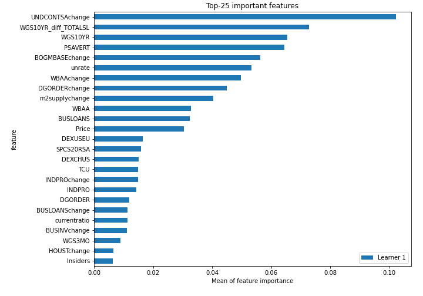
## Confusion Matrix

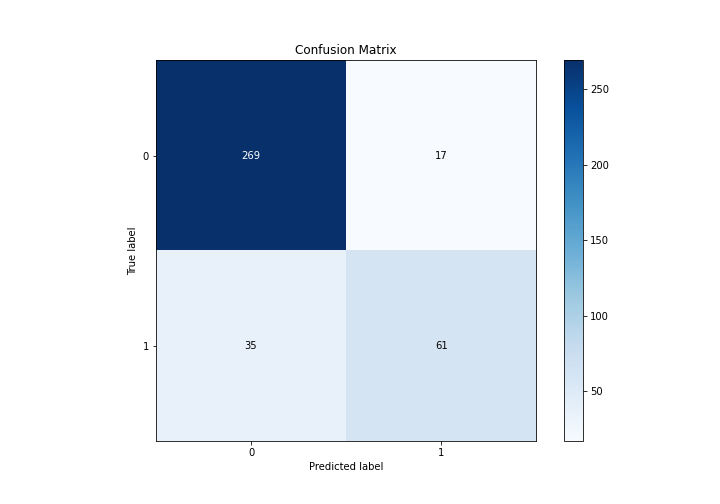

## Normalized Confusion Matrix

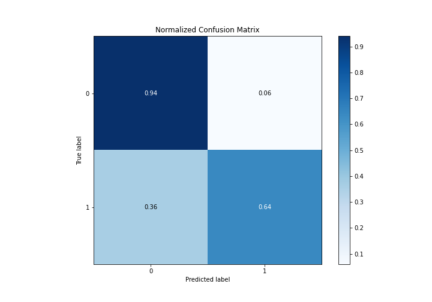

## ROC Curve

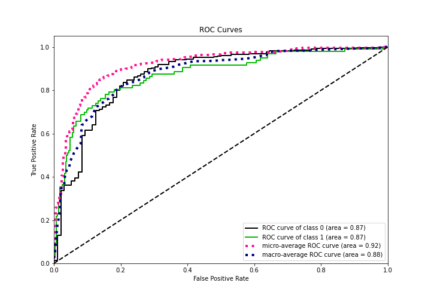

## Kolmogorov-Smirnov Statistic

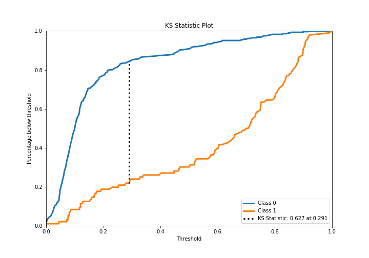

## Precision-Recall Curve

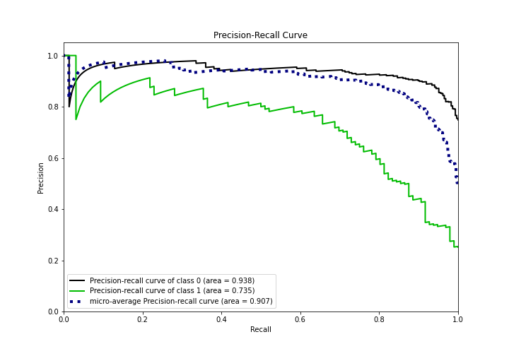

## Calibration Curve

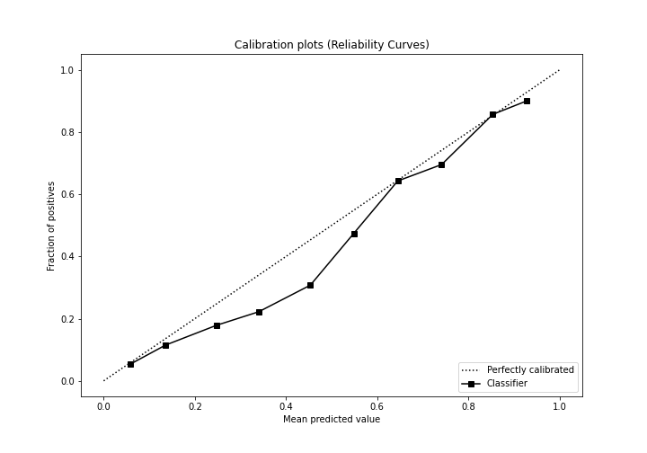

## Cumulative Gains Curve

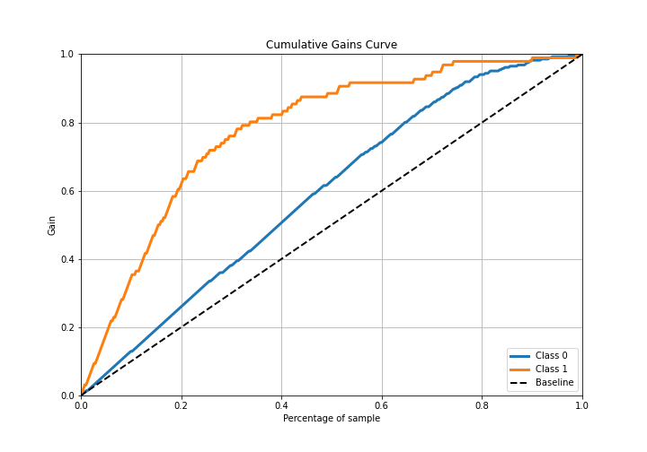

## Lift Curve

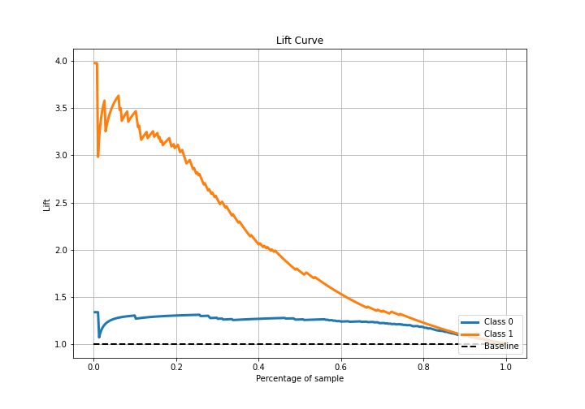

## SHAP Importance
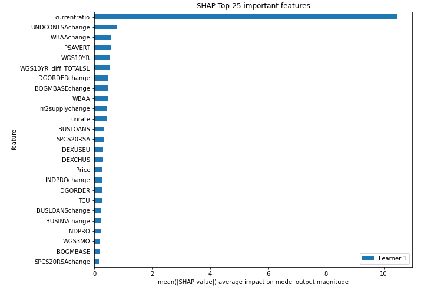

## SHAP Dependence plots

### Dependence (Fold 1)
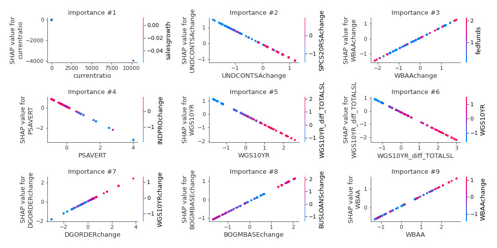

## SHAP Decision plots

### Top-10 Worst decisions for class 0 (Fold 1)
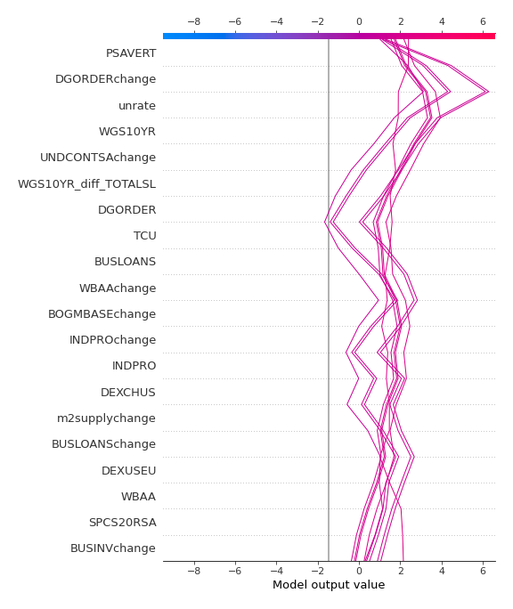
### Top-10 Best decisions for class 0 (Fold 1)
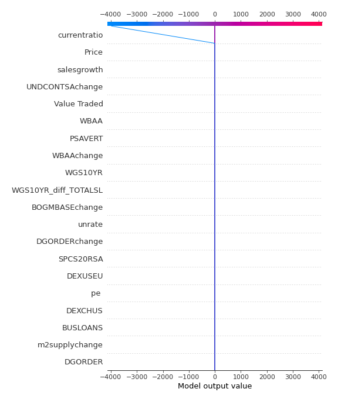
### Top-10 Worst decisions for class 1 (Fold 1)
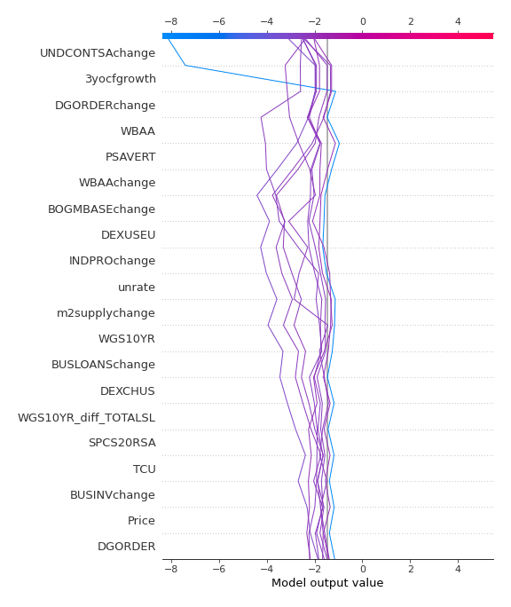
### Top-10 Best decisions for class 1 (Fold 1)
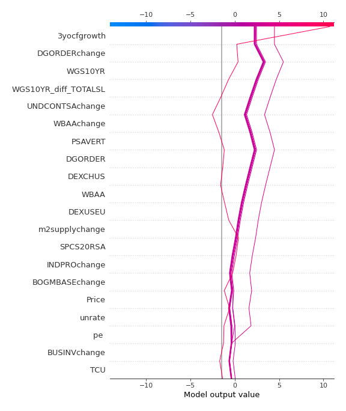

[<< Go back](../README.md)
