# Summary of 3_Linear_KMeansFeatures

[<< Go back](../README.md)

## Logistic Regression (Linear)
- **n_jobs**: -1
- **explain_level**: 2

## Validation
 - **validation_type**: split
 - **train_ratio**: 0.75
 - **shuffle**: True
 - **stratify**: True

## Optimized metric
average_precision

## Training time

3.9 seconds

## Metric details
|           |    score |   threshold |
|:----------|---------:|------------:|
| logloss   | 0.367894 |  nan        |
| auc       | 0.874599 |  nan        |
| f1        | 0.720812 |    0.448796 |
| accuracy  | 0.858639 |    0.488318 |
| precision | 1        |    0.88548  |
| recall    | 1        |    0        |
| mcc       | 0.62426  |    0.448796 |

## Metric details with threshold from accuracy metric
|           |    score |   threshold |
|:----------|---------:|------------:|
| logloss   | 0.367894 |  nan        |
| auc       | 0.874599 |  nan        |
| f1        | 0.715789 |    0.488318 |
| accuracy  | 0.858639 |    0.488318 |
| precision | 0.723404 |    0.488318 |
| recall    | 0.708333 |    0.488318 |
| mcc       | 0.621788 |    0.488318 |

## Confusion matrix (at threshold=0.488318)
|              |   Predicted as 0 |   Predicted as 1 |
|:-------------|-----------------:|-----------------:|
| Labeled as 0 |              260 |               26 |
| Labeled as 1 |               28 |               68 |

## Learning curves
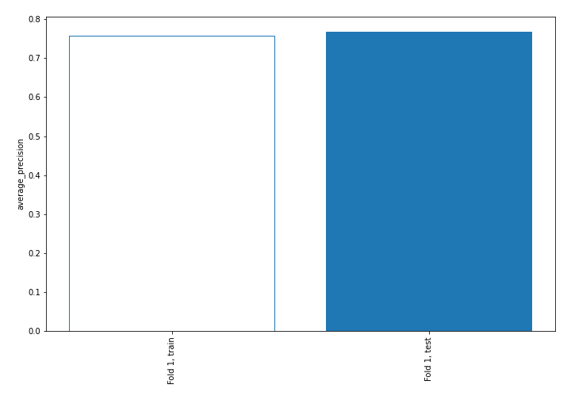

## Coefficients
| feature             |    Learner_1 |
|:--------------------|-------------:|
| DGORDERchange       |  0.725377    |
| unrate              |  0.705491    |
| WBAAchange          |  0.62368     |
| Dist_Cluster_21     |  0.551416    |
| BOGMBASEchange      |  0.514732    |
| DEXCHUS             |  0.425044    |
| WBAA                |  0.379369    |
| pfcf                |  0.348786    |
| INDPRO              |  0.329969    |
| roe                 |  0.321941    |
| TCU                 |  0.296752    |
| Dist_Cluster_10     |  0.292739    |
| Dist_Cluster_15     |  0.287695    |
| Dist_Cluster_19     |  0.269246    |
| netdebtebitda       |  0.239973    |
| 3yocfgrowth         |  0.237237    |
| assetgrowth         |  0.234225    |
| BOGMBASE            |  0.231164    |
| capexsales          |  0.229492    |
| Dist_Cluster_23     |  0.227519    |
| roic                |  0.209671    |
| Insiders            |  0.206655    |
| inventorygrowth     |  0.195986    |
| Dist_Cluster_2      |  0.19584     |
| TOTALSL             |  0.190032    |
| Dist_Cluster_3      |  0.182994    |
| Dist_Cluster_1      |  0.182677    |
| 1ybeforepricechange |  0.177413    |
| DEXCHUSchange       |  0.176913    |
| Dist_Cluster_22     |  0.171783    |
| pocf                |  0.160736    |
| PSAVERTchange       |  0.149811    |
| evebitda            |  0.136737    |
| pe                  |  0.131347    |
| HOUSTchange         |  0.130376    |
| Cluster             |  0.0935811   |
| Dist_Cluster_12     |  0.0887084   |
| WGS3MOchange        |  0.0717362   |
| Own Change          |  0.0714441   |
| fcfgrowth           |  0.0459864   |
| Dist_Cluster_13     |  0.0174432   |
| evs                 |  0.0122953   |
| 1ychangepe          |  0.005667    |
| Dist_Cluster_11     |  0.0032242   |
| ps                  | -0.000747181 |
| pb                  | -0.00357618  |
| ptb                 | -0.00357618  |
| debttoassets        | -0.00625047  |
| ebitgrowth          | -0.0212409   |
| HOUST               | -0.0376313   |
| debttoequity        | -0.0468618   |
| Dist_Cluster_5      | -0.04932     |
| Dist_Cluster_18     | -0.0571633   |
| m2supply            | -0.0586768   |
| BUSINV              | -0.0611421   |
| Dist_Cluster_14     | -0.0617489   |
| capexocf            | -0.0645394   |
| 3yequitygrowth      | -0.0697638   |
| evfcf               | -0.0702269   |
| fedfundschange      | -0.0787224   |
| TOTALSLchange       | -0.116708    |
| Dist_Cluster_9      | -0.126352    |
| DEXUSEUchange       | -0.132506    |
| SPCS20RSAchange     | -0.134257    |
| UNDCONTSA           | -0.134752    |
| sbcsales            | -0.147078    |
| BUSLOANSchange      | -0.151189    |
| BUSINVchange        | -0.152203    |
| fedfunds            | -0.155268    |
| Dist_Cluster_17     | -0.163118    |
| interestcoverage    | -0.175728    |
| Dist_Cluster_4      | -0.183502    |
| Dist_Cluster_6      | -0.189944    |
| Value Traded        | -0.200818    |
| TCUchange           | -0.23425     |
| evocf               | -0.2367      |
| Dist_Cluster_0      | -0.25368     |
| DGORDER             | -0.264794    |
| SPCS20RSA           | -0.280975    |
| DEXUSEU             | -0.288305    |
| debtgrowth          | -0.312198    |
| 3ysalesgrowth       | -0.357097    |
| INDPROchange        | -0.364992    |
| currentratio        | -0.38261     |
| WGS3MO              | -0.447005    |
| Dist_Cluster_16     | -0.457374    |
| m2supplychange      | -0.494916    |
| Dist_Cluster_20     | -0.528627    |
| Dist_Cluster_7      | -0.530911    |
| BUSLOANS            | -0.531262    |
| WGS10YRchange       | -0.572798    |
| salesgrowth         | -0.587962    |
| Dist_Cluster_8      | -0.598294    |
| Price               | -0.614313    |
| PSAVERT             | -0.695222    |
| UNDCONTSAchange     | -0.744152    |
| WGS10YR             | -0.865809    |
| intercept           | -1.40947     |

## Permutation-based Importance
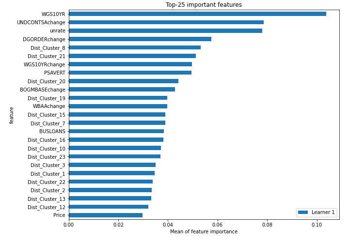
## Confusion Matrix

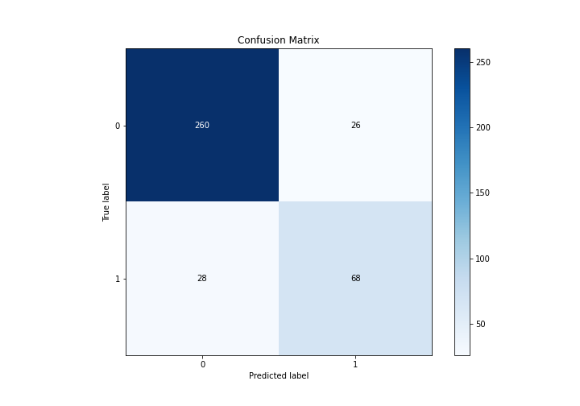

## Normalized Confusion Matrix

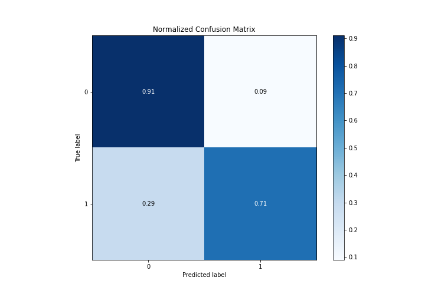

## ROC Curve

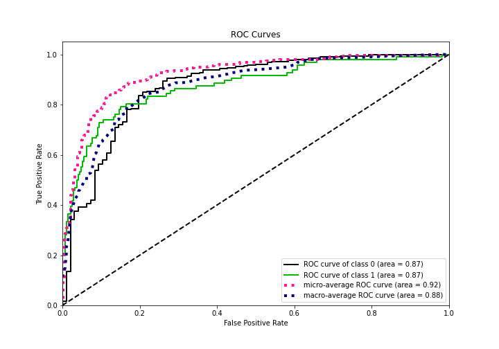

## Kolmogorov-Smirnov Statistic

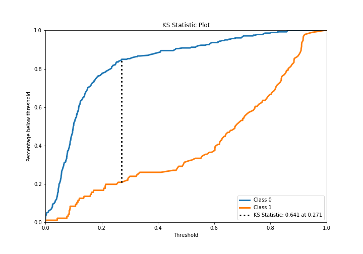

## Precision-Recall Curve

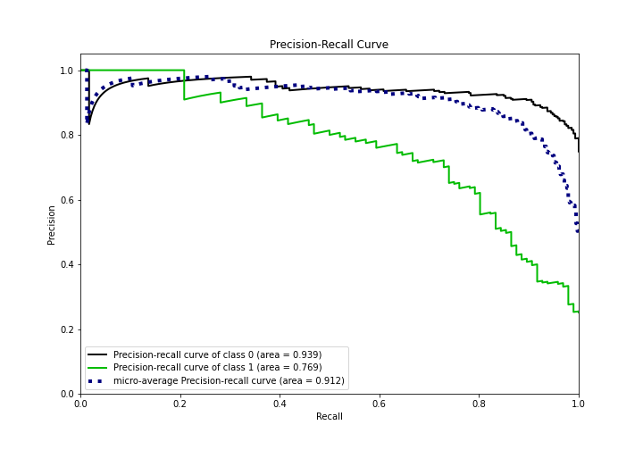

## Calibration Curve

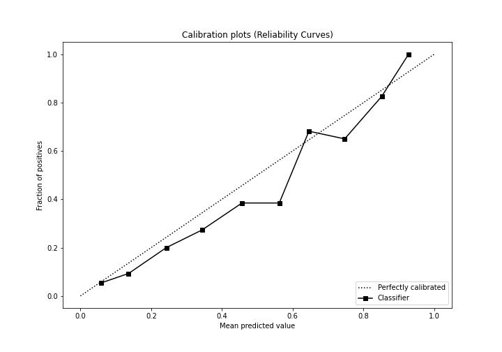

## Cumulative Gains Curve

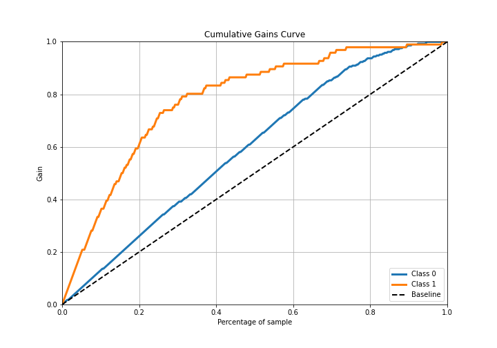

## Lift Curve

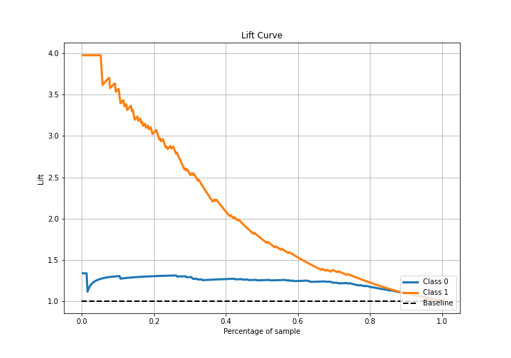

## SHAP Importance
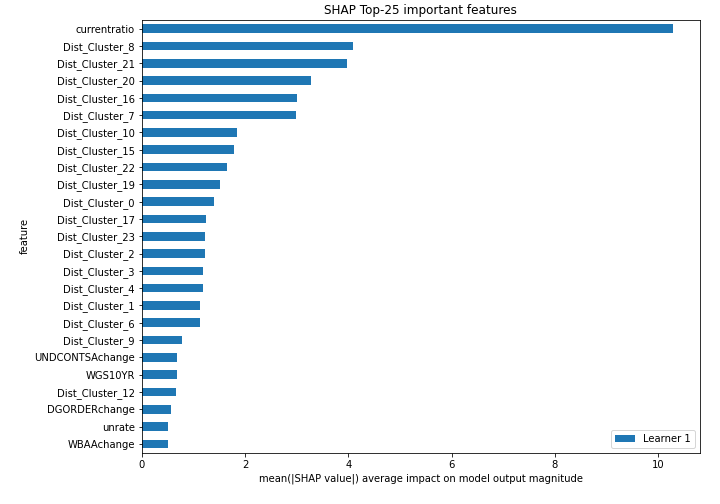

## SHAP Dependence plots

### Dependence (Fold 1)
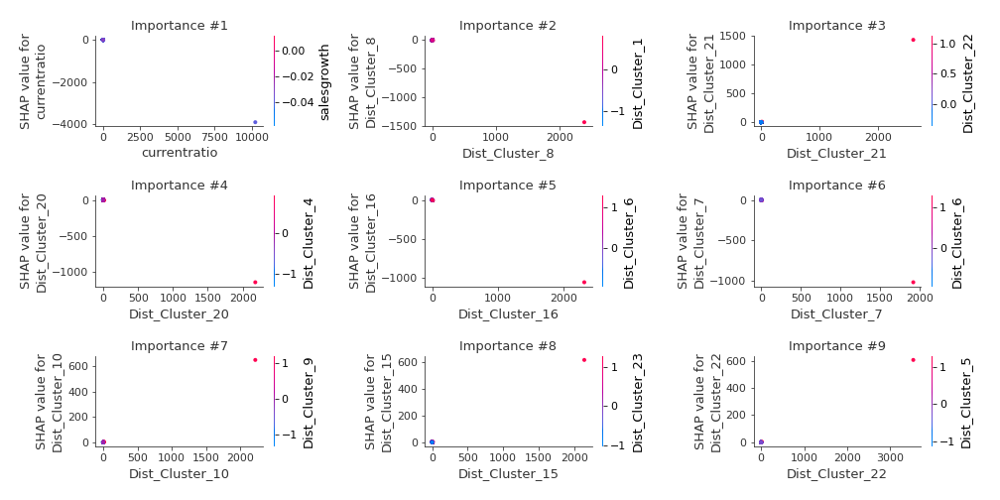

## SHAP Decision plots

### Top-10 Worst decisions for class 0 (Fold 1)
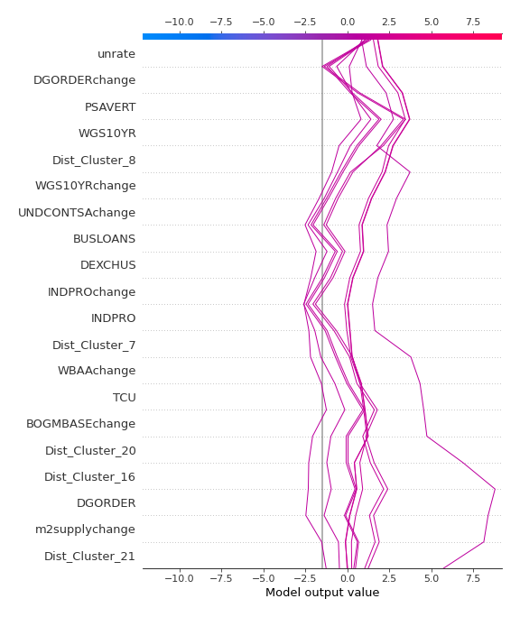
### Top-10 Best decisions for class 0 (Fold 1)
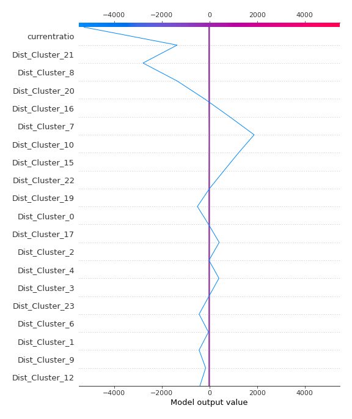
### Top-10 Worst decisions for class 1 (Fold 1)
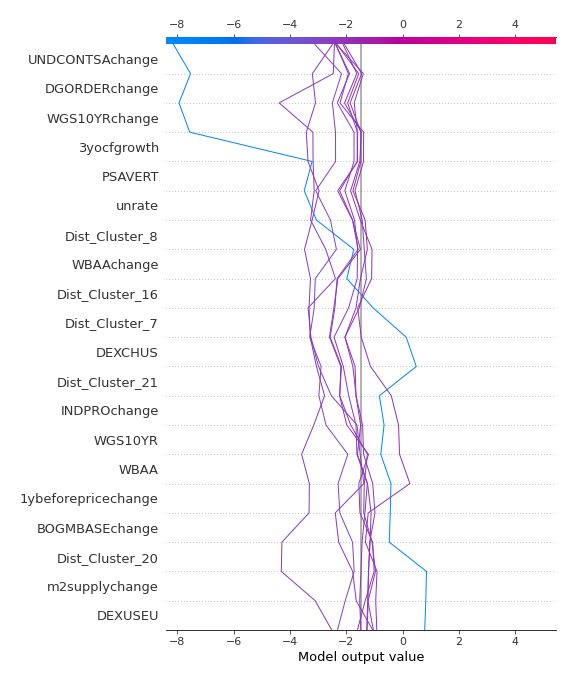
### Top-10 Best decisions for class 1 (Fold 1)
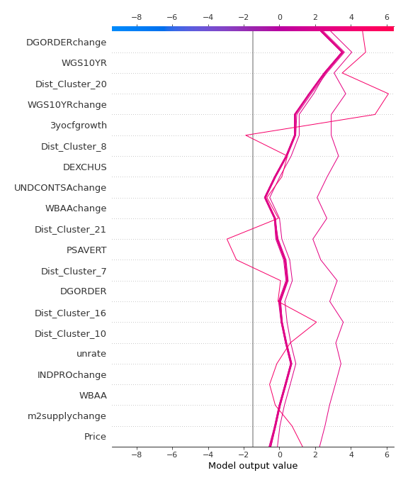

[<< Go back](../README.md)
