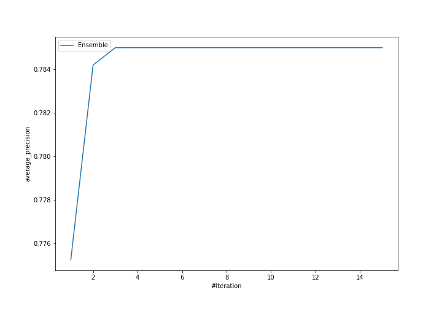
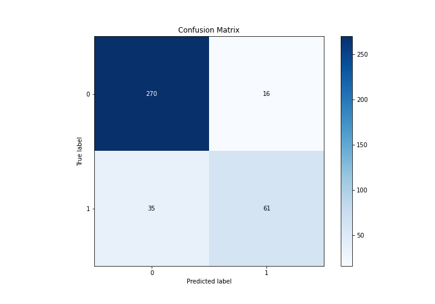
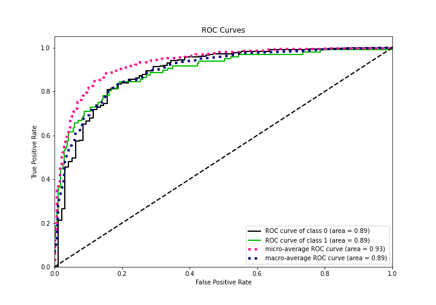
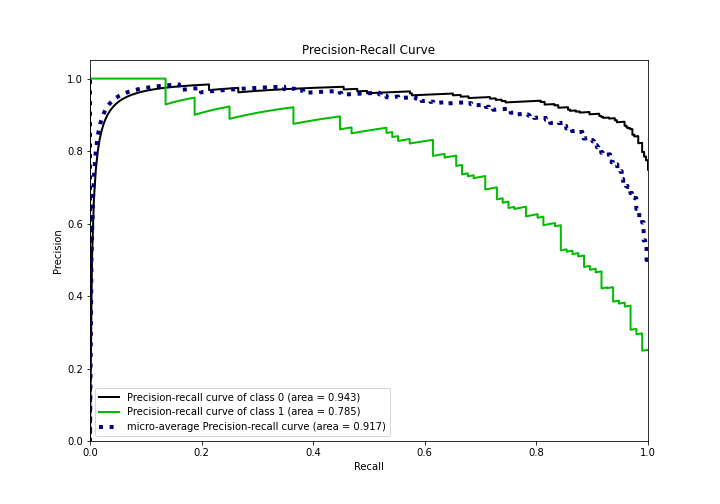
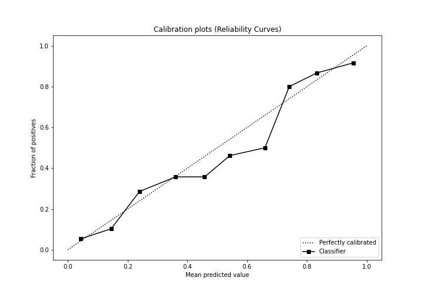
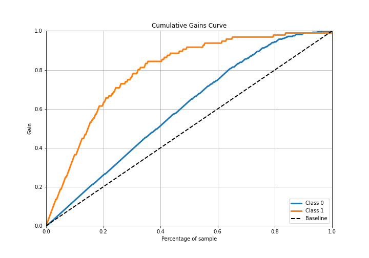
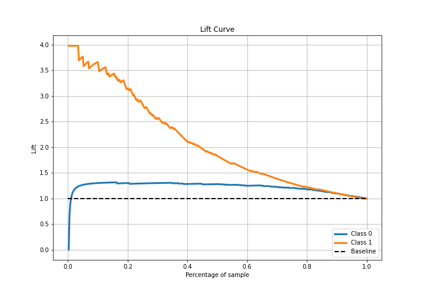

# Summary of Ensemble

[<< Go back](../README.md)

## Ensemble structure
| Model                                                  |   Weight |
|:-------------------------------------------------------|---------:|
| 3_Linear_KMeansFeatures                                |        1 |
| 6_Default_RandomForest_KMeansFeatures                  |        1 |
| 6_Default_RandomForest_KMeansFeatures_SelectedFeatures |        1 |

## Metric details
|           |    score |   threshold |
|:----------|---------:|------------:|
| logloss   | 0.347647 | nan         |
| auc       | 0.891208 | nan         |
| f1        | 0.712042 |   0.449463  |
| accuracy  | 0.866492 |   0.548659  |
| precision | 0.928571 |   0.880686  |
| recall    | 1        |   0.0396275 |
| mcc       | 0.626551 |   0.548659  |

## Metric details with threshold from accuracy metric
|           |    score |   threshold |
|:----------|---------:|------------:|
| logloss   | 0.347647 |  nan        |
| auc       | 0.891208 |  nan        |
| f1        | 0.705202 |    0.548659 |
| accuracy  | 0.866492 |    0.548659 |
| precision | 0.792208 |    0.548659 |
| recall    | 0.635417 |    0.548659 |
| mcc       | 0.626551 |    0.548659 |

## Confusion matrix (at threshold=0.548659)
|              |   Predicted as 0 |   Predicted as 1 |
|:-------------|-----------------:|-----------------:|
| Labeled as 0 |              270 |               16 |
| Labeled as 1 |               35 |               61 |

## Learning curves

## Confusion Matrix

## Normalized Confusion Matrix

## ROC Curve

## Kolmogorov-Smirnov Statistic

## Precision-Recall Curve

## Calibration Curve

## Cumulative Gains Curve

## Lift Curve

[<< Go back](../README.md)
