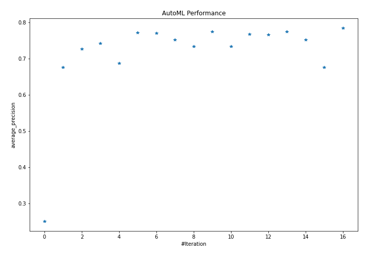
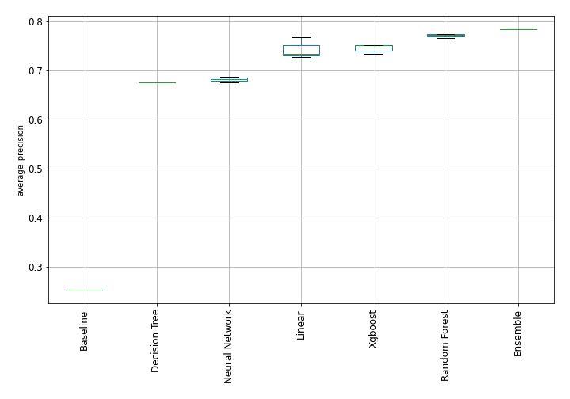
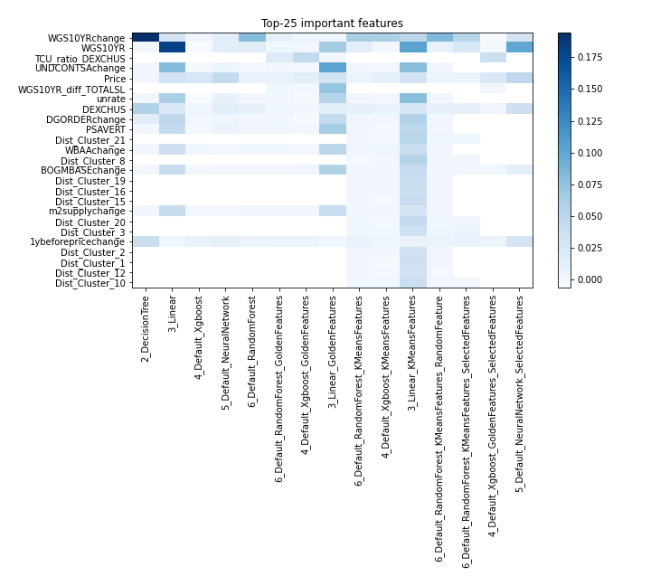
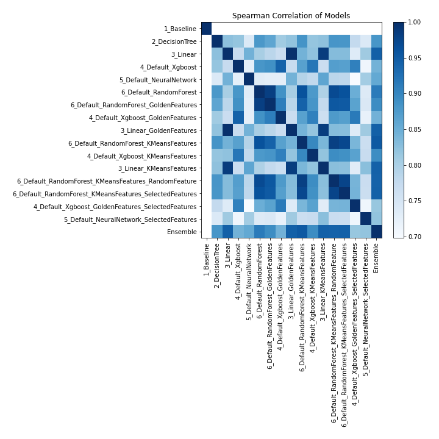

# AutoML Leaderboard

| Best model   | name                                                                                                                       | model_type     | metric_type       |   metric_value |   train_time |
|:-------------|:---------------------------------------------------------------------------------------------------------------------------|:---------------|:------------------|---------------:|-------------:|
|              | [1_Baseline](1_Baseline/README.md)                                                                                         | Baseline       | average_precision |       0.251309 |         0.77 |
|              | [2_DecisionTree](2_DecisionTree/README.md)                                                                                 | Decision Tree  | average_precision |       0.676108 |        10.97 |
|              | [3_Linear](3_Linear/README.md)                                                                                             | Linear         | average_precision |       0.72763  |         3.75 |
|              | [4_Default_Xgboost](4_Default_Xgboost/README.md)                                                                           | Xgboost        | average_precision |       0.743187 |         6.64 |
|              | [5_Default_NeuralNetwork](5_Default_NeuralNetwork/README.md)                                                               | Neural Network | average_precision |       0.687985 |         2.25 |
|              | [6_Default_RandomForest](6_Default_RandomForest/README.md)                                                                 | Random Forest  | average_precision |       0.77219  |         5.69 |
|              | [6_Default_RandomForest_GoldenFeatures](6_Default_RandomForest_GoldenFeatures/README.md)                                   | Random Forest  | average_precision |       0.770181 |         7.9  |
|              | [4_Default_Xgboost_GoldenFeatures](4_Default_Xgboost_GoldenFeatures/README.md)                                             | Xgboost        | average_precision |       0.752586 |         4.83 |
|              | [3_Linear_GoldenFeatures](3_Linear_GoldenFeatures/README.md)                                                               | Linear         | average_precision |       0.734823 |         3.49 |
|              | [6_Default_RandomForest_KMeansFeatures](6_Default_RandomForest_KMeansFeatures/README.md)                                   | Random Forest  | average_precision |       0.774396 |         6.59 |
|              | [4_Default_Xgboost_KMeansFeatures](4_Default_Xgboost_KMeansFeatures/README.md)                                             | Xgboost        | average_precision |       0.733728 |         6.19 |
|              | [3_Linear_KMeansFeatures](3_Linear_KMeansFeatures/README.md)                                                               | Linear         | average_precision |       0.768655 |         4.74 |
|              | [6_Default_RandomForest_KMeansFeatures_RandomFeature](6_Default_RandomForest_KMeansFeatures_RandomFeature/README.md)       | Random Forest  | average_precision |       0.765973 |         3.91 |
|              | [6_Default_RandomForest_KMeansFeatures_SelectedFeatures](6_Default_RandomForest_KMeansFeatures_SelectedFeatures/README.md) | Random Forest  | average_precision |       0.775238 |         5.69 |
|              | [4_Default_Xgboost_GoldenFeatures_SelectedFeatures](4_Default_Xgboost_GoldenFeatures_SelectedFeatures/README.md)           | Xgboost        | average_precision |       0.752628 |         6.01 |
|              | [5_Default_NeuralNetwork_SelectedFeatures](5_Default_NeuralNetwork_SelectedFeatures/README.md)                             | Neural Network | average_precision |       0.6766   |         2.38 |
| **the best** | [Ensemble](Ensemble/README.md)                                                                                             | Ensemble       | average_precision |       0.784986 |         0.57 |

### AutoML Performance

### AutoML Performance Boxplot

### Features Importance

### Spearman Correlation of Models

