# Summary of 3_Linear

[<< Go back](../README.md)

## Logistic Regression (Linear)
- **n_jobs**: -1
- **explain_level**: 2

## Validation
 - **validation_type**: split
 - **train_ratio**: 0.75
 - **shuffle**: True
 - **stratify**: True

## Optimized metric
average_precision

## Training time

2.5 seconds

## Metric details
|           |    score |   threshold |
|:----------|---------:|------------:|
| logloss   | 0.399849 |  nan        |
| auc       | 0.749569 |  nan        |
| f1        | 0.408163 |    0.312996 |
| accuracy  | 0.861257 |    0.421573 |
| precision | 0.75     |    0.421573 |
| recall    | 1        |    0        |
| mcc       | 0.325787 |    0.312996 |

## Metric details with threshold from accuracy metric
|           |     score |   threshold |
|:----------|----------:|------------:|
| logloss   | 0.399849  |  nan        |
| auc       | 0.749569  |  nan        |
| f1        | 0.101695  |    0.421573 |
| accuracy  | 0.861257  |    0.421573 |
| precision | 0.75      |    0.421573 |
| recall    | 0.0545455 |    0.421573 |
| mcc       | 0.177574  |    0.421573 |

## Confusion matrix (at threshold=0.421573)
|              |   Predicted as 0 |   Predicted as 1 |
|:-------------|-----------------:|-----------------:|
| Labeled as 0 |              326 |                1 |
| Labeled as 1 |               52 |                3 |

## Learning curves
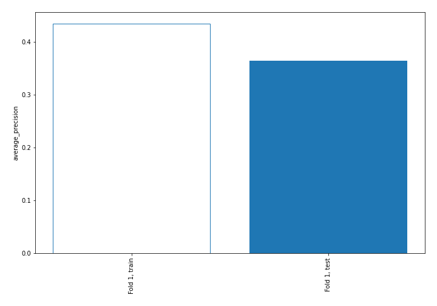

## Coefficients
| feature             |   Learner_1 |
|:--------------------|------------:|
| BUSINVchange        |  1.03399    |
| WGS10YR             |  0.99543    |
| m2supplychange      |  0.73969    |
| evocf               |  0.633652   |
| HOUST               |  0.612966   |
| DEXUSEU             |  0.541982   |
| assetgrowth         |  0.340065   |
| WGS10YRchange       |  0.271771   |
| PSAVERT             |  0.202282   |
| INDPROchange        |  0.197397   |
| SPCS20RSA           |  0.192292   |
| TOTALSL             |  0.190576   |
| fedfundschange      |  0.167728   |
| debttoassets        |  0.144487   |
| evs                 |  0.132837   |
| BUSLOANSchange      |  0.0960001  |
| BOGMBASE            |  0.0889397  |
| salesgrowth         |  0.0744559  |
| BUSINV              |  0.0744336  |
| evfcf               |  0.0706598  |
| debttoequity        |  0.0612306  |
| evebitda            |  0.0525086  |
| 3yocfgrowth         |  0.0450901  |
| TCUchange           |  0.0440186  |
| Value Traded        |  0.0415141  |
| SPCS20RSAchange     |  0.0398956  |
| Own Change          |  0.03776    |
| ptb                 |  0.0349127  |
| pb                  |  0.0349127  |
| m2supply            |  0.0295348  |
| 3ysalesgrowth       |  0.0247836  |
| debtgrowth          |  0.0218573  |
| ebitgrowth          |  0.0157894  |
| pfcf                |  0.0123902  |
| 1ychangepe          |  0.0111878  |
| 3yequitygrowth      |  0.00114963 |
| Insiders            | -0.00749554 |
| sbcsales            | -0.0308175  |
| ps                  | -0.0369249  |
| WGS3MOchange        | -0.0490611  |
| netdebtebitda       | -0.0549536  |
| DEXCHUSchange       | -0.0578354  |
| UNDCONTSA           | -0.0843738  |
| DGORDER             | -0.0932356  |
| interestcoverage    | -0.0984449  |
| fedfunds            | -0.115887   |
| capexsales          | -0.124766   |
| pe                  | -0.125859   |
| DGORDERchange       | -0.140841   |
| inventorygrowth     | -0.183131   |
| Price               | -0.193413   |
| WGS3MO              | -0.199411   |
| PSAVERTchange       | -0.206623   |
| capexocf            | -0.233887   |
| INDPRO              | -0.267563   |
| HOUSTchange         | -0.280913   |
| TOTALSLchange       | -0.304672   |
| BUSLOANS            | -0.314046   |
| roe                 | -0.323678   |
| 1ybeforepricechange | -0.325471   |
| TCU                 | -0.362981   |
| fcfgrowth           | -0.423806   |
| DEXCHUS             | -0.462053   |
| roic                | -0.475381   |
| DEXUSEUchange       | -0.500826   |
| pocf                | -0.654817   |
| WBAA                | -0.752806   |
| BOGMBASEchange      | -0.817886   |
| WBAAchange          | -0.851985   |
| UNDCONTSAchange     | -0.853287   |
| unrate              | -1.03258    |
| currentratio        | -1.03887    |
| intercept           | -2.45337    |

## Permutation-based Importance
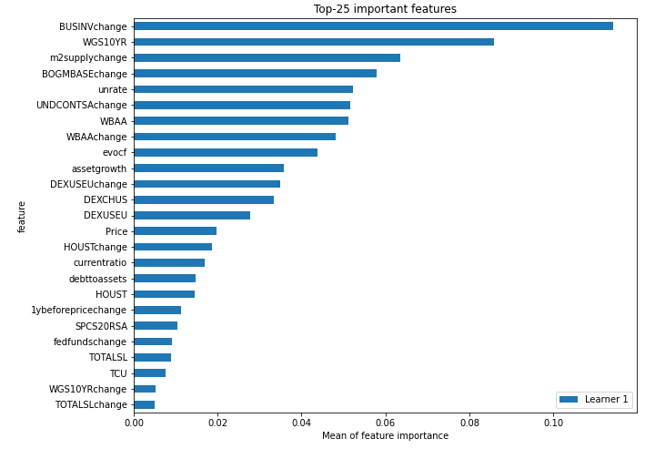
## Confusion Matrix

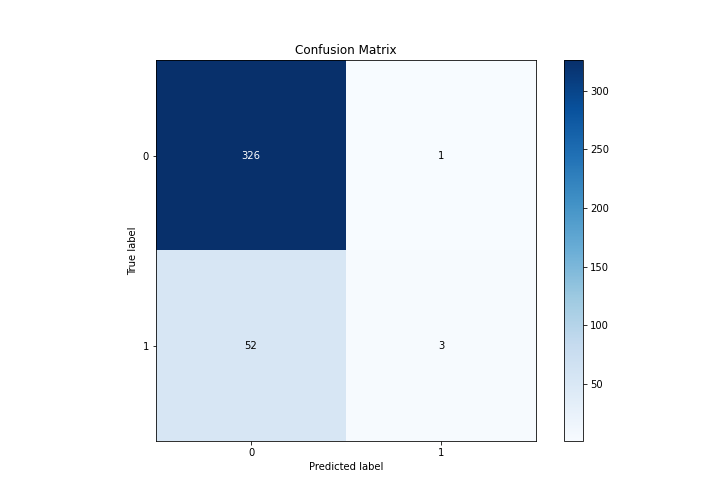

## Normalized Confusion Matrix

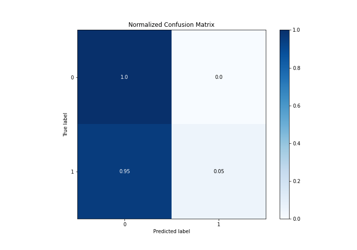

## ROC Curve

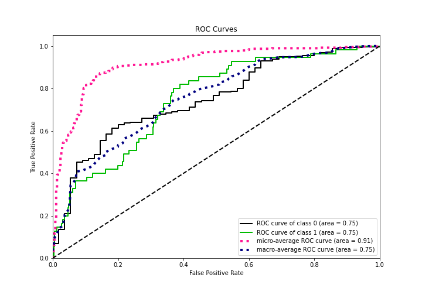

## Kolmogorov-Smirnov Statistic

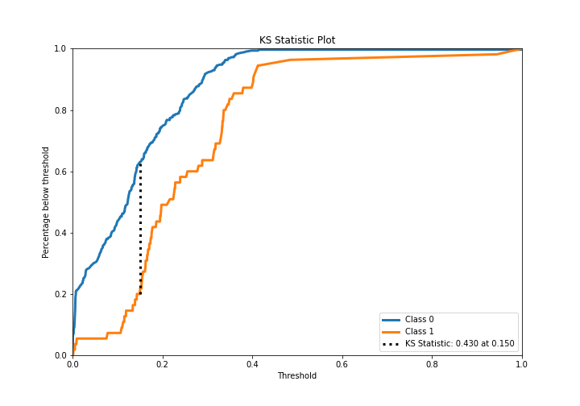

## Precision-Recall Curve

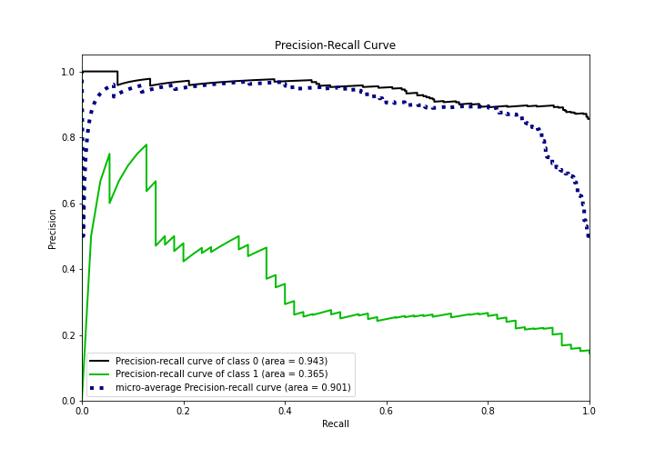

## Calibration Curve

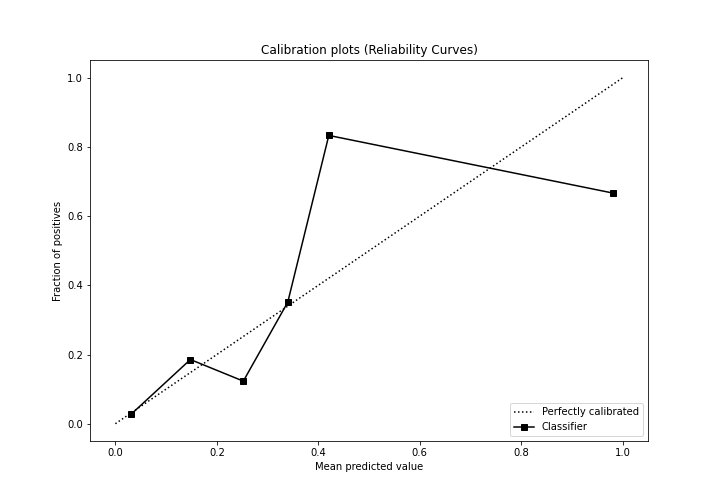

## Cumulative Gains Curve

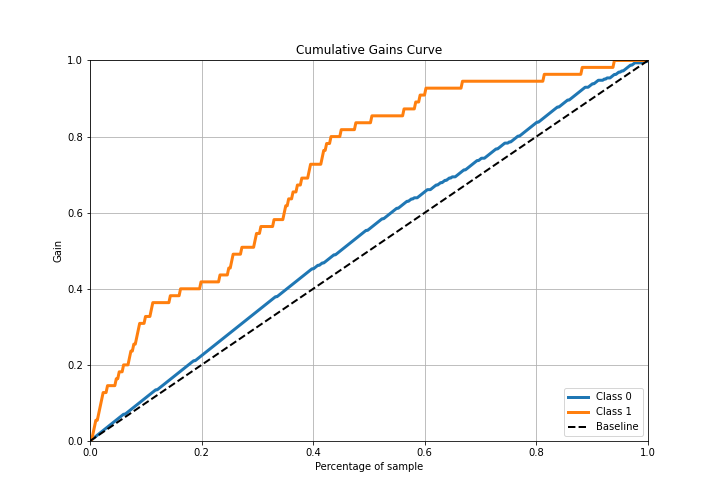

## Lift Curve

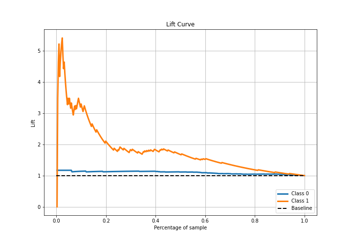

## SHAP Importance
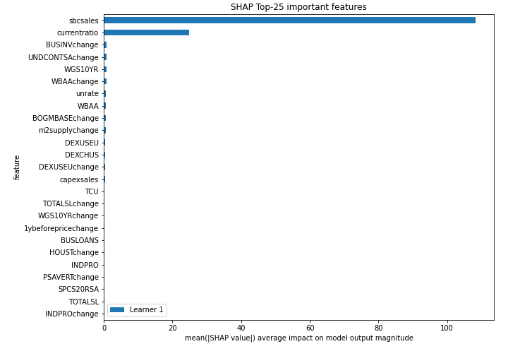

## SHAP Dependence plots

### Dependence (Fold 1)
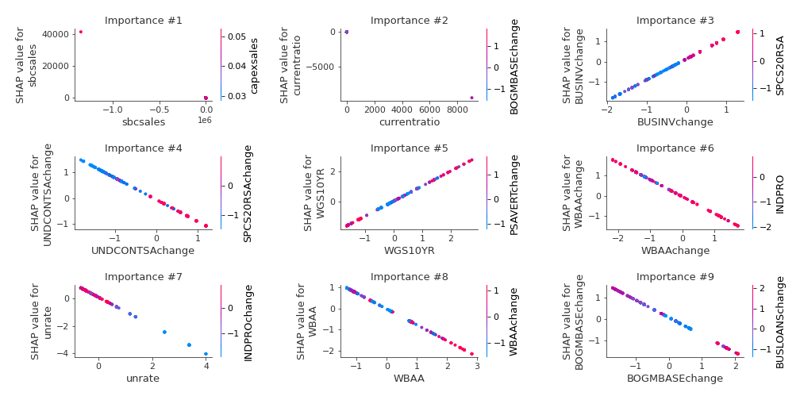

## SHAP Decision plots

### Top-10 Worst decisions for class 0 (Fold 1)
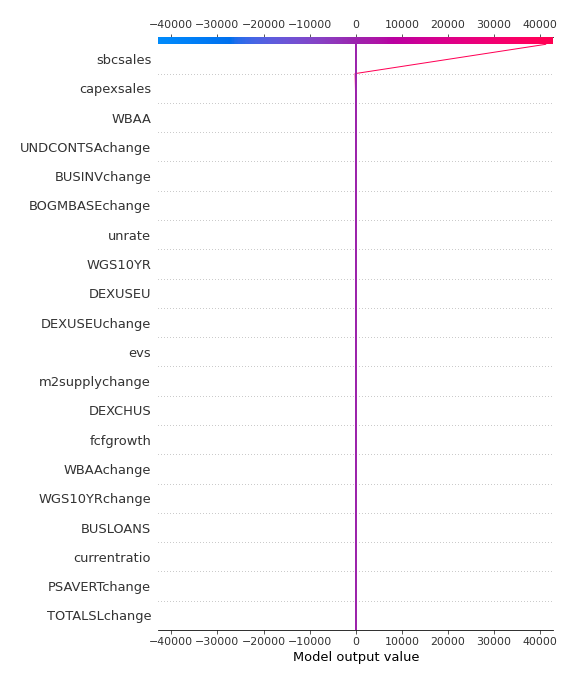
### Top-10 Best decisions for class 0 (Fold 1)
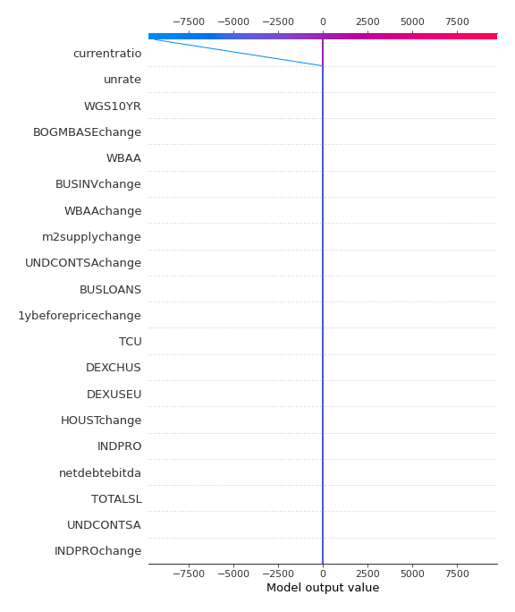
### Top-10 Worst decisions for class 1 (Fold 1)
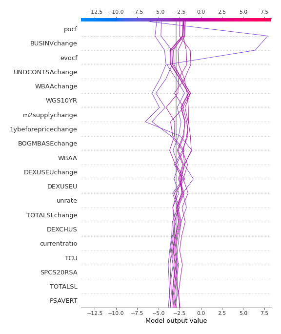
### Top-10 Best decisions for class 1 (Fold 1)
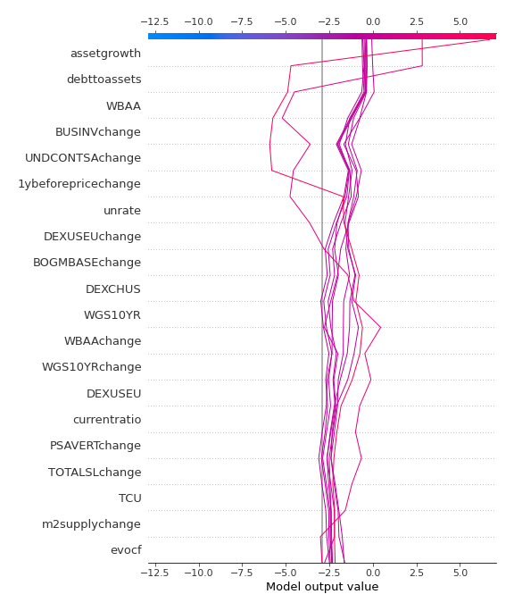

[<< Go back](../README.md)
