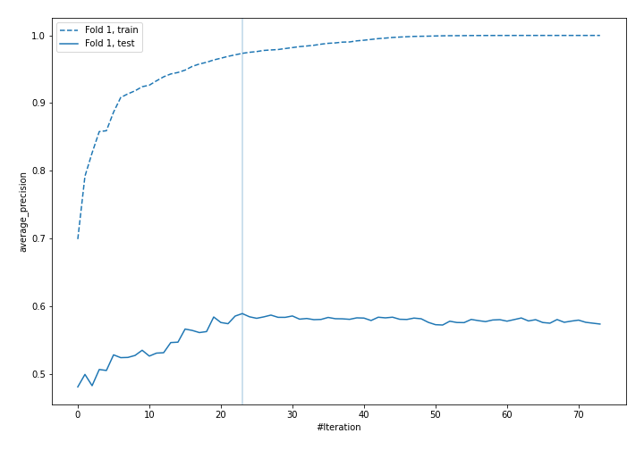
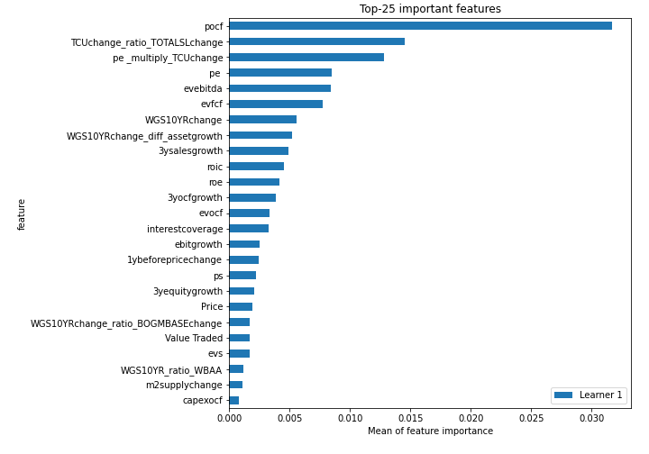
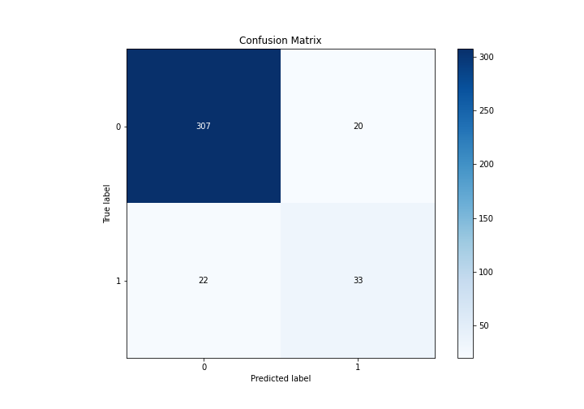
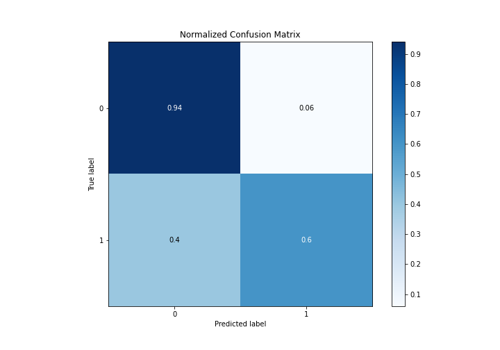
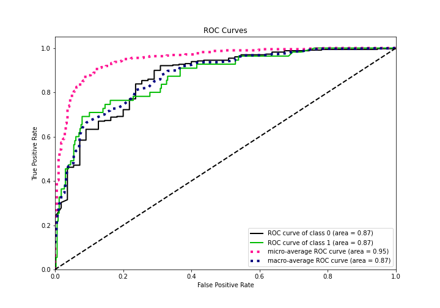
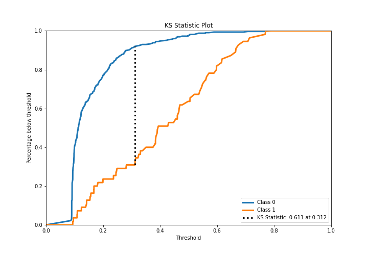
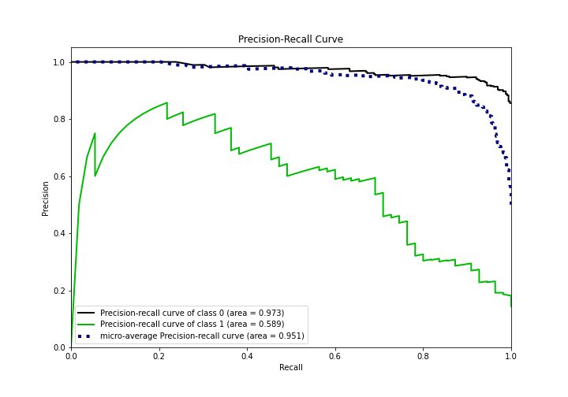
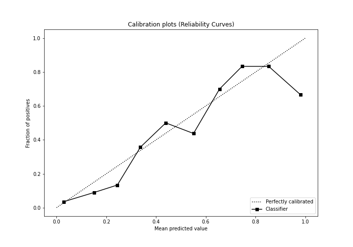
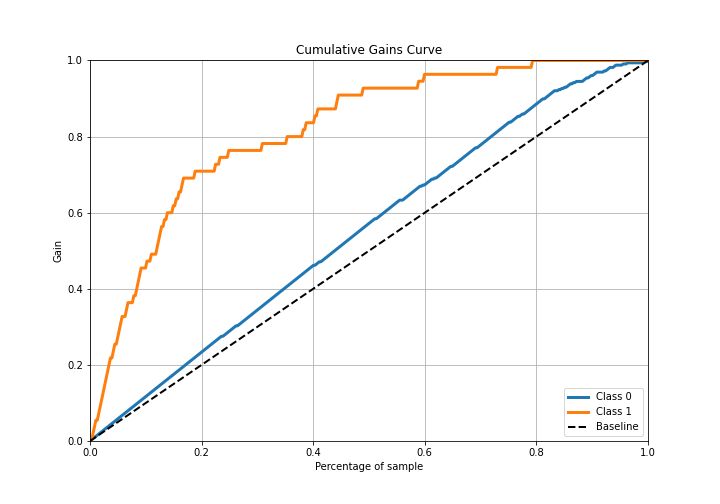
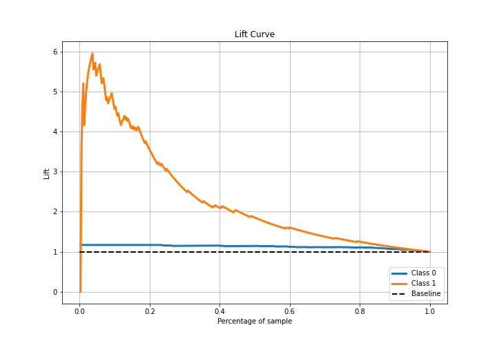

# Summary of 4_Default_Xgboost_GoldenFeatures_RandomFeature

[<< Go back](../README.md)

## Extreme Gradient Boosting (Xgboost)
- **n_jobs**: -1
- **objective**: binary:logistic
- **eta**: 0.075
- **max_depth**: 6
- **min_child_weight**: 1
- **subsample**: 1.0
- **colsample_bytree**: 1.0
- **eval_metric**: average_precision
- **explain_level**: 1

## Validation
 - **validation_type**: split
 - **train_ratio**: 0.75
 - **shuffle**: True
 - **stratify**: True

## Optimized metric
average_precision

## Training time

2.3 seconds

## Metric details
|           |    score |   threshold |
|:----------|---------:|------------:|
| logloss   | 0.312181 | nan         |
| auc       | 0.870753 | nan         |
| f1        | 0.633333 |   0.311504  |
| accuracy  | 0.890052 |   0.379587  |
| precision | 0.833333 |   0.609663  |
| recall    | 1        |   0.0761624 |
| mcc       | 0.56835  |   0.311504  |

## Metric details with threshold from accuracy metric
|           |    score |   threshold |
|:----------|---------:|------------:|
| logloss   | 0.312181 |  nan        |
| auc       | 0.870753 |  nan        |
| f1        | 0.611111 |    0.379587 |
| accuracy  | 0.890052 |    0.379587 |
| precision | 0.622642 |    0.379587 |
| recall    | 0.6      |    0.379587 |
| mcc       | 0.54724  |    0.379587 |

## Confusion matrix (at threshold=0.379587)
|              |   Predicted as 0 |   Predicted as 1 |
|:-------------|-----------------:|-----------------:|
| Labeled as 0 |              307 |               20 |
| Labeled as 1 |               22 |               33 |

## Learning curves

## Permutation-based Importance

## Confusion Matrix

## Normalized Confusion Matrix

## ROC Curve

## Kolmogorov-Smirnov Statistic

## Precision-Recall Curve

## Calibration Curve

## Cumulative Gains Curve

## Lift Curve

[<< Go back](../README.md)
