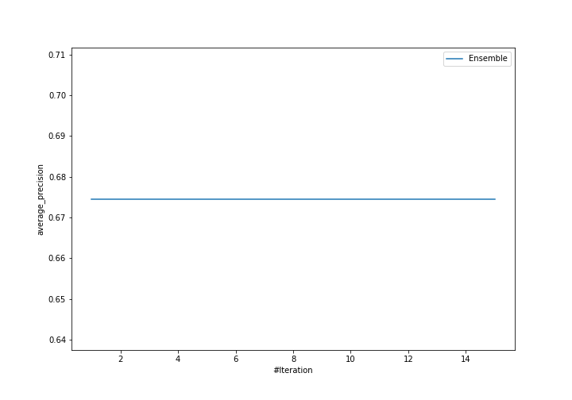
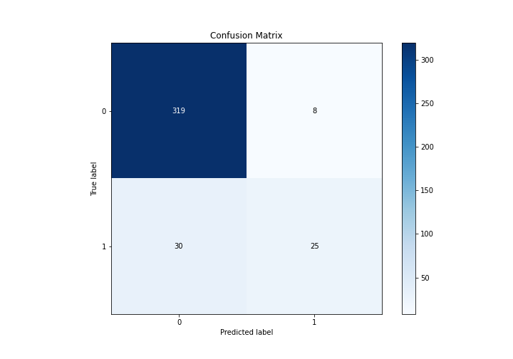
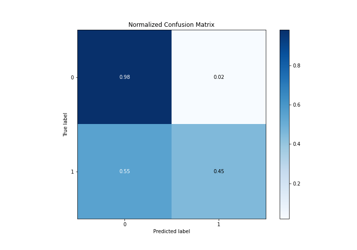
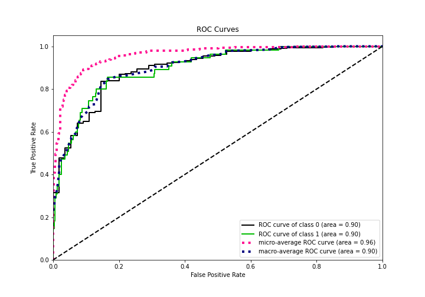
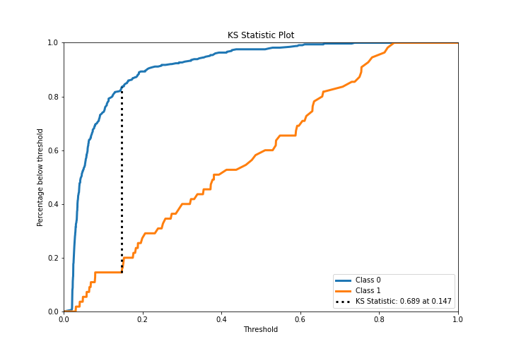
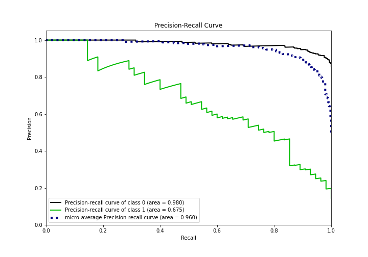
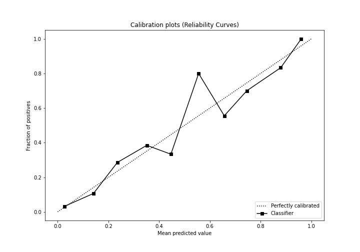
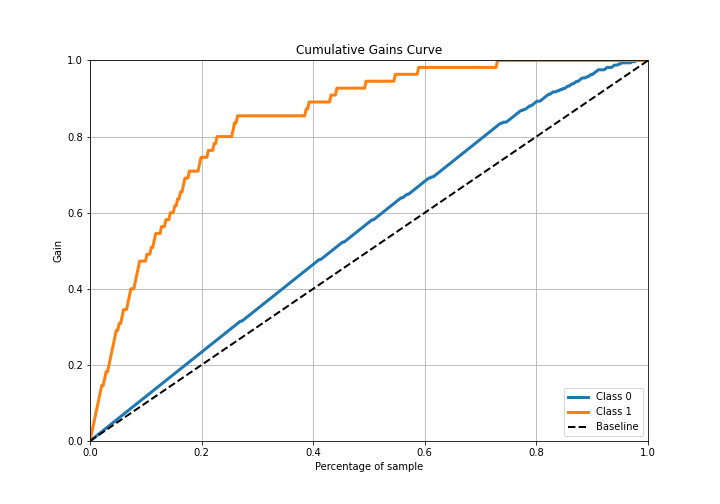
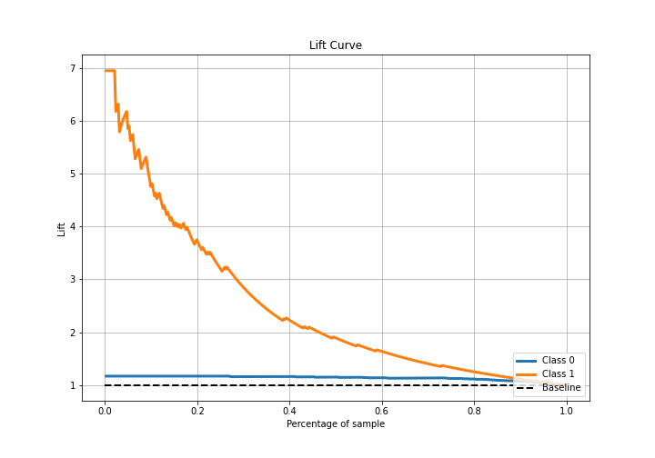

# Summary of Ensemble

[<< Go back](../README.md)

## Ensemble structure
| Model                                             |   Weight |
|:--------------------------------------------------|---------:|
| 4_Default_Xgboost_GoldenFeatures_SelectedFeatures |        1 |

## Metric details
|           |    score |   threshold |
|:----------|---------:|------------:|
| logloss   | 0.260017 | nan         |
| auc       | 0.898527 | nan         |
| f1        | 0.633333 |   0.250544  |
| accuracy  | 0.900524 |   0.472718  |
| precision | 0.909091 |   0.687809  |
| recall    | 1        |   0.0185443 |
| mcc       | 0.56835  |   0.250544  |

## Metric details with threshold from accuracy metric
|           |    score |   threshold |
|:----------|---------:|------------:|
| logloss   | 0.260017 |  nan        |
| auc       | 0.898527 |  nan        |
| f1        | 0.568182 |    0.472718 |
| accuracy  | 0.900524 |    0.472718 |
| precision | 0.757576 |    0.472718 |
| recall    | 0.454545 |    0.472718 |
| mcc       | 0.537447 |    0.472718 |

## Confusion matrix (at threshold=0.472718)
|              |   Predicted as 0 |   Predicted as 1 |
|:-------------|-----------------:|-----------------:|
| Labeled as 0 |              319 |                8 |
| Labeled as 1 |               30 |               25 |

## Learning curves

## Confusion Matrix

## Normalized Confusion Matrix

## ROC Curve

## Kolmogorov-Smirnov Statistic

## Precision-Recall Curve

## Calibration Curve

## Cumulative Gains Curve

## Lift Curve

[<< Go back](../README.md)
