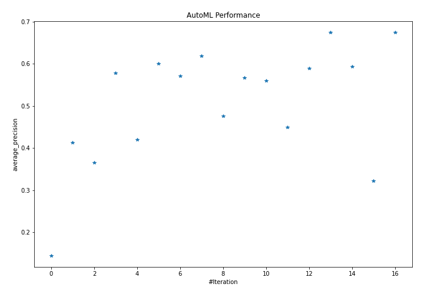
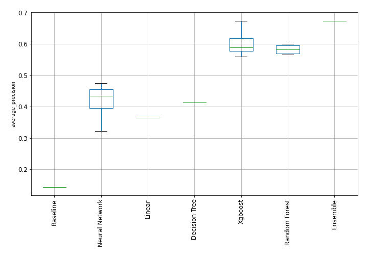
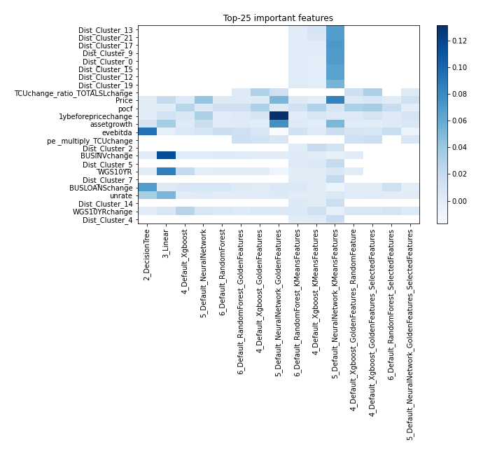
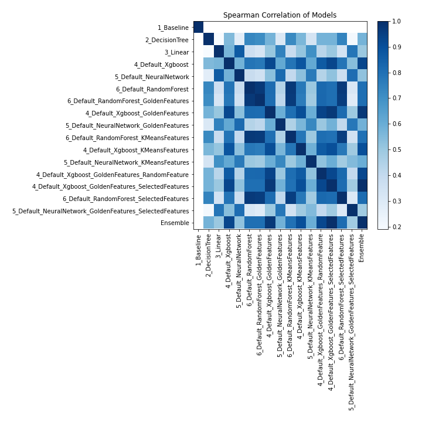

# AutoML Leaderboard

| Best model   | name                                                                                                                         | model_type     | metric_type       |   metric_value |   train_time |
|:-------------|:-----------------------------------------------------------------------------------------------------------------------------|:---------------|:------------------|---------------:|-------------:|
|              | [1_Baseline](1_Baseline/README.md)                                                                                           | Baseline       | average_precision |       0.143979 |         0.68 |
|              | [2_DecisionTree](2_DecisionTree/README.md)                                                                                   | Decision Tree  | average_precision |       0.413238 |        10.3  |
|              | [3_Linear](3_Linear/README.md)                                                                                               | Linear         | average_precision |       0.364799 |         3.08 |
|              | [4_Default_Xgboost](4_Default_Xgboost/README.md)                                                                             | Xgboost        | average_precision |       0.577354 |         3.98 |
|              | [5_Default_NeuralNetwork](5_Default_NeuralNetwork/README.md)                                                                 | Neural Network | average_precision |       0.419834 |         1.44 |
|              | [6_Default_RandomForest](6_Default_RandomForest/README.md)                                                                   | Random Forest  | average_precision |       0.600561 |         7.56 |
|              | [6_Default_RandomForest_GoldenFeatures](6_Default_RandomForest_GoldenFeatures/README.md)                                     | Random Forest  | average_precision |       0.570392 |         7.27 |
|              | [4_Default_Xgboost_GoldenFeatures](4_Default_Xgboost_GoldenFeatures/README.md)                                               | Xgboost        | average_precision |       0.617838 |         3.92 |
|              | [5_Default_NeuralNetwork_GoldenFeatures](5_Default_NeuralNetwork_GoldenFeatures/README.md)                                   | Neural Network | average_precision |       0.476102 |         1.88 |
|              | [6_Default_RandomForest_KMeansFeatures](6_Default_RandomForest_KMeansFeatures/README.md)                                     | Random Forest  | average_precision |       0.566507 |         6.04 |
|              | [4_Default_Xgboost_KMeansFeatures](4_Default_Xgboost_KMeansFeatures/README.md)                                               | Xgboost        | average_precision |       0.560049 |         4.61 |
|              | [5_Default_NeuralNetwork_KMeansFeatures](5_Default_NeuralNetwork_KMeansFeatures/README.md)                                   | Neural Network | average_precision |       0.448999 |         2.33 |
|              | [4_Default_Xgboost_GoldenFeatures_RandomFeature](4_Default_Xgboost_GoldenFeatures_RandomFeature/README.md)                   | Xgboost        | average_precision |       0.588996 |         2.89 |
| **the best** | [4_Default_Xgboost_GoldenFeatures_SelectedFeatures](4_Default_Xgboost_GoldenFeatures_SelectedFeatures/README.md)             | Xgboost        | average_precision |       0.674537 |         4.41 |
|              | [6_Default_RandomForest_SelectedFeatures](6_Default_RandomForest_SelectedFeatures/README.md)                                 | Random Forest  | average_precision |       0.593792 |         4.72 |
|              | [5_Default_NeuralNetwork_GoldenFeatures_SelectedFeatures](5_Default_NeuralNetwork_GoldenFeatures_SelectedFeatures/README.md) | Neural Network | average_precision |       0.322288 |         1.99 |
|              | [Ensemble](Ensemble/README.md)                                                                                               | Ensemble       | average_precision |       0.674537 |         0.47 |

### AutoML Performance

### AutoML Performance Boxplot

### Features Importance

### Spearman Correlation of Models

