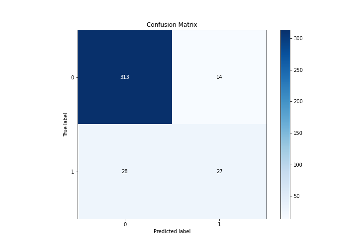
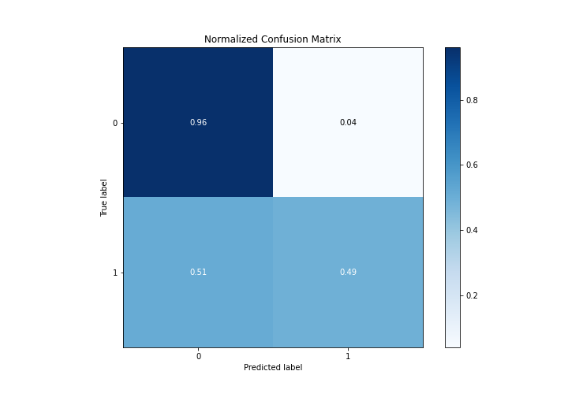
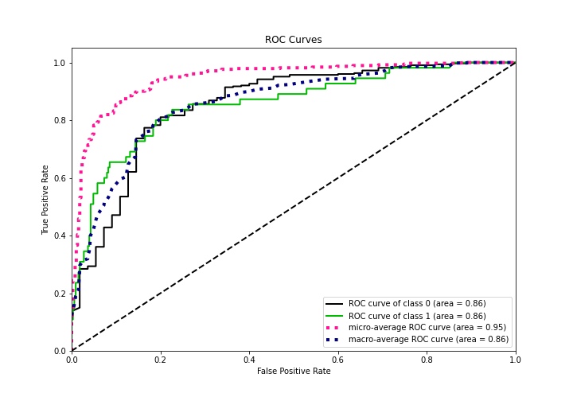
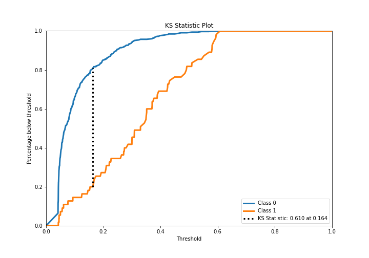
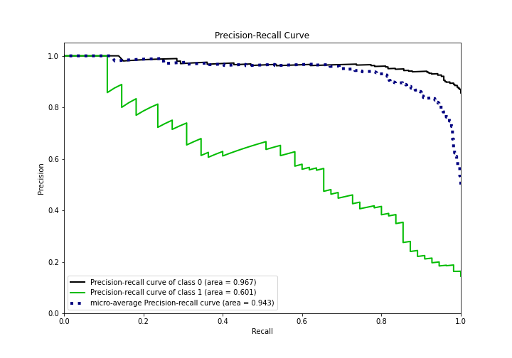
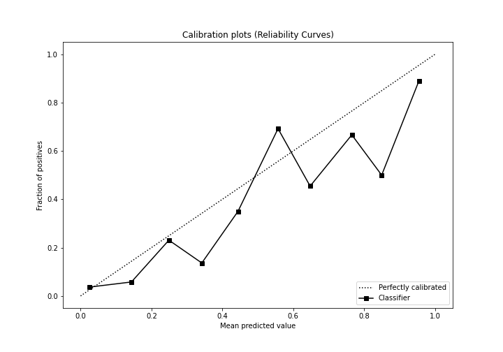
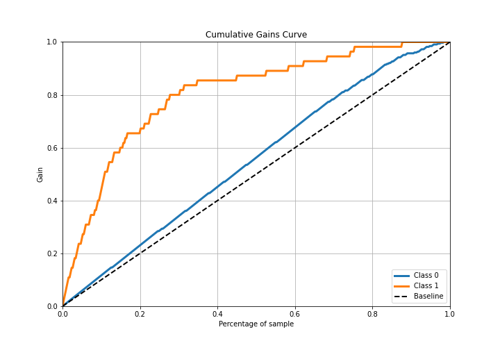
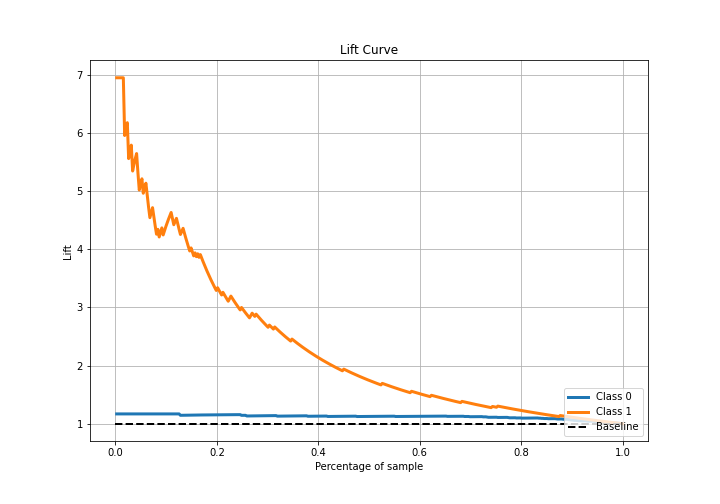

# Summary of Ensemble

[<< Go back](../README.md)

## Ensemble structure
| Model                  |   Weight |
|:-----------------------|---------:|
| 6_Default_RandomForest |        1 |

## Metric details
|           |    score |   threshold |
|:----------|---------:|------------:|
| logloss   | 0.300417 | nan         |
| auc       | 0.856214 | nan         |
| f1        | 0.605042 |   0.263316  |
| accuracy  | 0.890052 |   0.338573  |
| precision | 0.875    |   0.552269  |
| recall    | 1        |   0.0372879 |
| mcc       | 0.534813 |   0.263316  |

## Metric details with threshold from accuracy metric
|           |    score |   threshold |
|:----------|---------:|------------:|
| logloss   | 0.300417 |  nan        |
| auc       | 0.856214 |  nan        |
| f1        | 0.5625   |    0.338573 |
| accuracy  | 0.890052 |    0.338573 |
| precision | 0.658537 |    0.338573 |
| recall    | 0.490909 |    0.338573 |
| mcc       | 0.508226 |    0.338573 |

## Confusion matrix (at threshold=0.338573)
|              |   Predicted as 0 |   Predicted as 1 |
|:-------------|-----------------:|-----------------:|
| Labeled as 0 |              313 |               14 |
| Labeled as 1 |               28 |               27 |

## Learning curves

## Confusion Matrix

## Normalized Confusion Matrix

## ROC Curve

## Kolmogorov-Smirnov Statistic

## Precision-Recall Curve

## Calibration Curve

## Cumulative Gains Curve

## Lift Curve

[<< Go back](../README.md)
