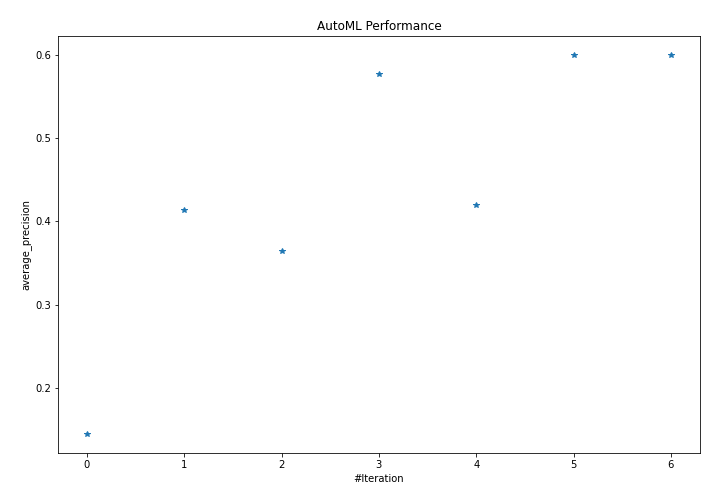
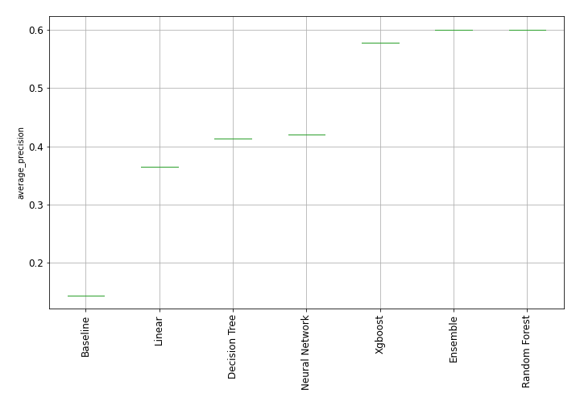
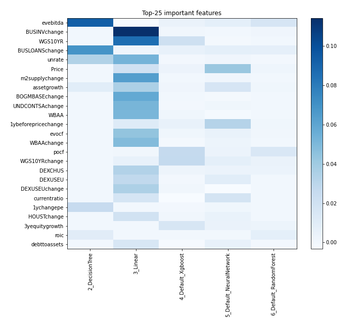
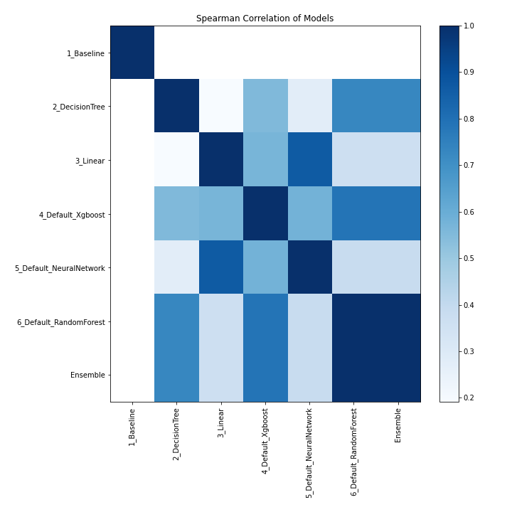

# AutoML Leaderboard

| Best model   | name                                                         | model_type     | metric_type       |   metric_value |   train_time |
|:-------------|:-------------------------------------------------------------|:---------------|:------------------|---------------:|-------------:|
|              | [1_Baseline](1_Baseline/README.md)                           | Baseline       | average_precision |       0.143979 |         0.7  |
|              | [2_DecisionTree](2_DecisionTree/README.md)                   | Decision Tree  | average_precision |       0.413238 |        10.82 |
|              | [3_Linear](3_Linear/README.md)                               | Linear         | average_precision |       0.364799 |         3.76 |
|              | [4_Default_Xgboost](4_Default_Xgboost/README.md)             | Xgboost        | average_precision |       0.577354 |         5.39 |
|              | [5_Default_NeuralNetwork](5_Default_NeuralNetwork/README.md) | Neural Network | average_precision |       0.419834 |         1.94 |
| **the best** | [6_Default_RandomForest](6_Default_RandomForest/README.md)   | Random Forest  | average_precision |       0.600561 |         8.18 |
|              | [Ensemble](Ensemble/README.md)                               | Ensemble       | average_precision |       0.600561 |         0.36 |

### AutoML Performance

### AutoML Performance Boxplot

### Features Importance

### Spearman Correlation of Models

